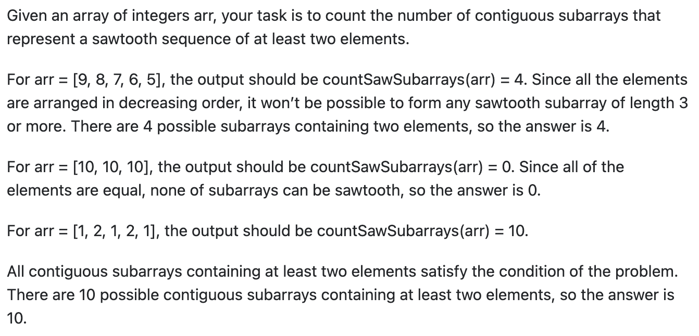

https://stackoverflow.com/questions/69356332/counting-contiguous-sawtooth-subarrays

https://leetcode.com/discuss/interview-question/1578318/Uber-OA-or-Codesignal/1150431

## Question
 
</img>

A [sawtooth sequence](https://en.wikipedia.org/wiki/Sawtooth_wave?ref=morioh.com&utm_source=morioh.com#:~:text=The%20convention%20is%20that%20a,of%20an%20asymmetric%20triangle%20wave.) is a sequence of number that alternate between increasing and decreasing. In other words, each element is either strictly greater than it’s neighboring element or strictly less than it’s neighboring elements.

## Solution