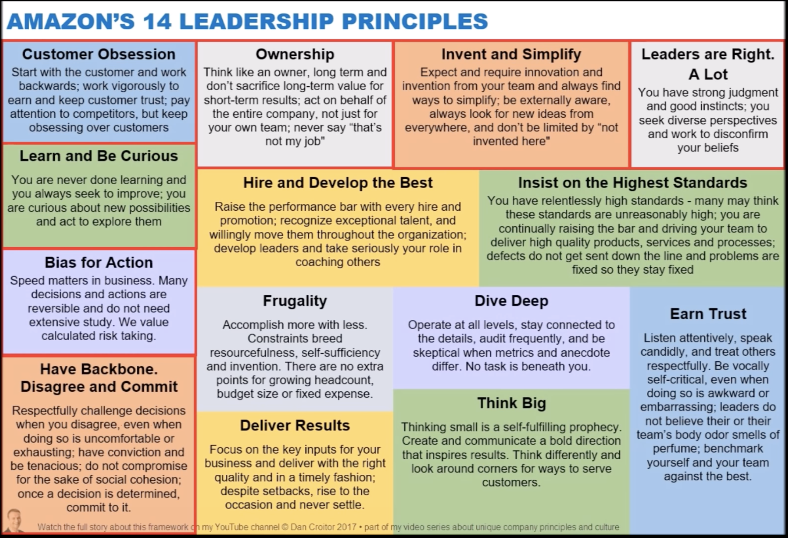
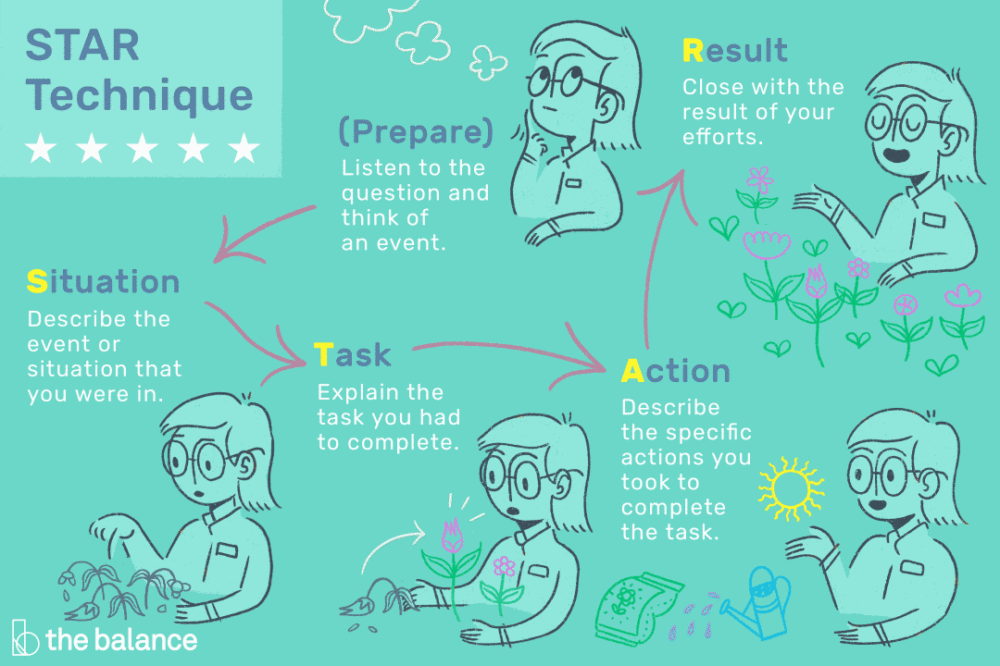

[youtube DanCroitor](https://www.youtube.com/c/DanCroitor)   
https://louiscarter.com/amazon-leadership-principles/   
https://www.1point3acres.com/bbs/thread-679738-1-1.html

- [STAR 原则](#star-原则)
- [14 Leadership Principles](#14-leadership-principles)
  - [[Customer Obsession 顾客至上]](#customer-obsession-顾客至上)
  - [Ownership 主人翁意识](#ownership-主人翁意识)
  - [Invent and Simplify 创新简化](#invent-and-simplify-创新简化)
  - [Are Right, A Lot 决策正确](#are-right-a-lot-决策正确)
  - [Learn and Be Curious 好奇求知](#learn-and-be-curious-好奇求知)
  - [Hire and Develop The Best 选贤育能](#hire-and-develop-the-best-选贤育能)
  - [Insist on Highest Standards 最高标准](#insist-on-highest-standards-最高标准)
  - [Think Big 远见卓识](#think-big-远见卓识)
  - [Bias for Action 崇尚行动](#bias-for-action-崇尚行动)
  - [Frugality 勤俭节约](#frugality-勤俭节约)
  - [Earn Trust 赢得信任](#earn-trust-赢得信任)
  - [Dive Deep 刨根问底](#dive-deep-刨根问底)
  - [Have Backbone; Disagree and Commit 敢于谏言，服从大局](#have-backbone-disagree-and-commit-敢于谏言服从大局)
  - [Deliver Results 达成业绩](#deliver-results-达成业绩)

<!--  -->

# STAR 原则

每个问题大概讲 3 min， 250 words，s + t -> 45s ~ 1min，action是重点！！

- Be Guidable: Interviewers will ask you to change directions frequently.
- Be ***Detail*** Orientated: Don’t skim stories. -> 使用Python Boto库来协调许多AWS的服务，包括IAM和S3。
- Be ***Data Oriented***: Talk about numbers and results. -> 提高了2倍的效率。
- Be ***Concise***: Don’t tell long monologues.
- Talk About ***Yourself***: Amazonians are interested in YOUR contribution.
- Be Earnest: If you don’t know an answer, say so. Say how have found similar answers before.

# 14 Leadership Principles

## [Customer Obsession 顾客至上]

**Description**

> Leaders start with the customer and work backwards. They work vigorously to earn and keep customer trust. Although leaders pay attention to competitors, they obsess over customers.   
> 领导者从客户入手，再反向推动工作。他们努力工作，赢得并维系客户对他们的信任。虽然领导者会关注竞争对手，但是他们更关注客户 。

**Qusations**

1. How will you prioritize customer’s needs when you are working with a large number of customers and also when it’s tricky to deliver excellent service to all of them?
2. Give an example of an event when you did not meet a client’s demand, what happened then, and how did you deal with it.
3. Who was your most challenging customer?
4. Tell me about the last time you had to apologize to someone.
5.  Can you remember a time when you obsessed over giving very high-quality service to a customer?

## Ownership 主人翁意识

**Description**

> Leaders are owners. They think long term and don’t sacrifice long-term value for short-term results. They act on behalf of the entire company, beyond just their own team. They never say “that’s not my job".   
领导者是主人翁。他们会从长远考虑，不会为了短期业绩而牺牲长期价值。他们不仅仅代表自己的团队，而且代表整个公司行事。他们绝不会说“那不是我的工作”。

关键点：主动解决问题，主动帮忙，主动了解别人的任务，主动组织lead一个task的启动、完成；不要说这不是我的工作，在等待别人完成

**Qusations**

https://louiscarter.com/amazon-leadership-principles/  
https://xingxingpark.com/Amazon-Behavior-Questions/   
https://posts.careerengine.us/p/5ff67372a4e1cc44b79fe77a

## Invent and Simplify 创新简化

**Description**

> Leaders expect and require innovation and invention from their teams and always find ways to simplify. They are externally aware, look for new ideas from everywhere, and are not limited by “not invented here". As we do new things, we accept that we may be misunderstood for long periods of time.  
领导者期望并要求自己的团队进行创新和发明，并始终寻求使工作简化的方法。他们了解外界动态，四处寻找新的创意，并且不局限于“非我发明”的观念。当我们开展新事物时，我们要接受被长期误解的可能。

关键点：对老的框架技术等主动去优化；对复杂的工作如何简化工作流程，想到新鲜的解决办法; eg. 签到: 手动 → 二维码

## Are Right, A Lot 决策正确

**Description**

> Leaders are right a lot. They have strong judgment and good instincts. They seek diverse perspectives and work to disconfirm their beliefs.   
领导者在大多数情况下都能做出正确的决定。他们拥有卓越的业务判断能力和敏锐的直觉。他们寻求多样的视角，并挑战自己的观念。

## Learn and Be Curious 好奇求知

**Description**

> Leaders are never done learning and always seek to improve themselves. They are curious about new possibilities and act to explore them.   
领导者从不停止学习，并不断寻找机会以提升自己。领导者对各种可能性充满好奇并付于行动加以探索。

关键点：保持学习和上进的状态；遇到某个问题怎么解决的，如上网查询等，突出自己的学习能力和上进心， 主动性，主动学习的态度， 主动提出解决办法；不要遇到问题等待别人给你解决，不要人云亦云

## Hire and Develop The Best 选贤育能

**Description**

> Leaders raise the performance bar with every hire and promotion. They recognize exceptional talent, and willingly move them throughout the organization. Leaders develop leaders and take seriously their role in coaching others. We work on behalf of our people to invent mechanisms for development like Career Choice.   
领导者不断提升招聘和晋升员工的标准。他们表彰杰出的人才，并乐于在组织中通过轮岗磨砺他们。领导者培养领导人才，他们严肃地对待自己育才树人的职责。领导者从员工角度出发，创建职业发展机制。

## Insist on Highest Standards 最高标准

**Description**

> Leaders have relentlessly high standards - many people may think these standards are unreasonably high. Leaders are continually raising the bar and driving their teams to deliver high quality products, services and processes. Leaders ensure that defects do not get sent down the line and that problems are fixed so they stay fixed.   
领导者有着近乎严苛的高标准 — 这些标准在很多人看来可能高得不可理喻。领导者不断提高标准，激励自己的团队提供优质产品、服务和流程。领导者会确保任何问题不会蔓延，及时彻底解决问题并确保问题不再出现。

## Think Big 远见卓识

**Description**

> Thinking small is a self-fulfilling prophecy. Leaders create and communicate a bold direction that inspires results. They think differently and look around corners for ways to serve customers.   
局限性思考只能带来局限性的结果。领导者大胆提出并阐明大局策略，由此激发良好的成果。他们从不同角度考虑问题，并广泛寻找服务客户的方式。

关键点：站在更高的角度想问题，不简简单单完成学校的proj，能不能有商业价值？？（二手买卖，租房平台，食物过期提醒）

## Bias for Action 崇尚行动

**Description**

> Speed matters in business. Many decisions and actions are reversible and do not need extensive study. We value calculated risk taking.   
速度对业务影响至关重要。很多决策和行动都可以改变，因此不需要进行过于广泛的推敲。我们提倡在深思熟虑前提下进行冒险。

关键点：主动尝试，在没人要某项task的时候主动承担承担，主动给出方案去实现某件事，只要做了就会有成果

## Frugality 勤俭节约

**Description**

> Accomplish more with less. Constraints breed resourcefulness, self-sufficiency and invention. There are no extra points for growing headcount, budget size or fixed expense.  
力争以更少的投入实现更大的产出。勤俭节约可以让我们开动脑筋、自给自足并不断创新。增加人力、预算以及固定支出并不会为你赢得额外加分。

## Earn Trust 赢得信任

**Description**

> Leaders listen attentively, speak candidly, and treat others respectfully. They are vocally self-critical, even when doing so is awkward or embarrassing. Leaders do not believe their or their team’s body odor smells of perfume. They benchmark themselves and their teams against the best.   
领导者专注倾听，坦诚沟通，尊重他人。领导者敢于自我批评，即便这样做会令自己尴尬或难堪。他们并不认为自己或其团队总是对的。领导者会以最佳领导者和团队为标准来要求自己及其团队。

## Dive Deep 刨根问底

**Description**

> Leaders operate at all levels, stay connected to the details, audit frequently, and are skeptical when metrics and anecdote differ. No task is beneath them.   
领导者深入各个环节，随时掌控细节，经常进行审核，当数据与传闻不一致时持有怀疑态度。领导者不会遗漏任何工作。

关键点：比如on call的时候遇到一个问题，之后问题又消失了，找到code，找到底层原因，弄清楚然后解决问题隐患

## Have Backbone; Disagree and Commit 敢于谏言，服从大局

**Description**

> Leaders are obligated to respectfully challenge decisions when they disagree, even when doing so is uncomfortable or exhausting. Leaders have conviction and are tenacious. They do not compromise for the sake of social cohesion. Once a decision is determined, they commit wholly.   
领导者必须要能够不卑不亢地质疑他们无法苟同的决策，哪怕这样做让人心烦意乱，精疲力尽。领导者要信念坚定，矢志不移。他们不会为了保持一团和气而屈就妥协。一旦做出决定，他们就会全身心地致力于实现目标。

## Deliver Results 达成业绩

**Description**

> Leaders focus on the key inputs for their business and deliver them with the right quality and in a timely fashion. Despite setbacks, they rise to the occasion and never settle.   
领导者会关注其业务的关键决定条件，确保工作质量并及时完成。尽管遭受挫折，领导者依然勇于面对挑战，从不气馁。

关键点：如何在时间紧任务重情况下完成任务，在这方面考虑case，不要明说加班，但可以讲自己偶尔在下班之后做一点工作