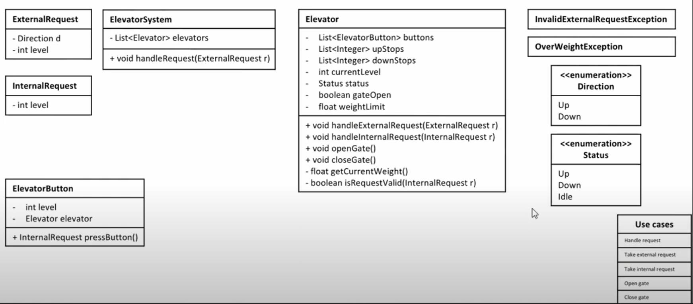
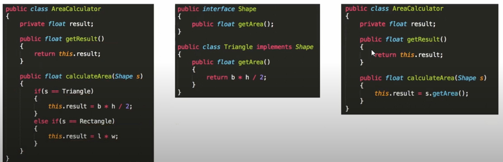
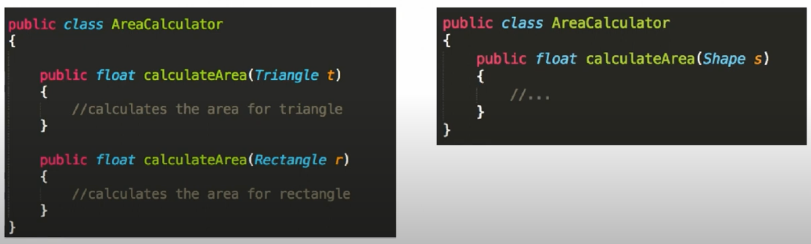
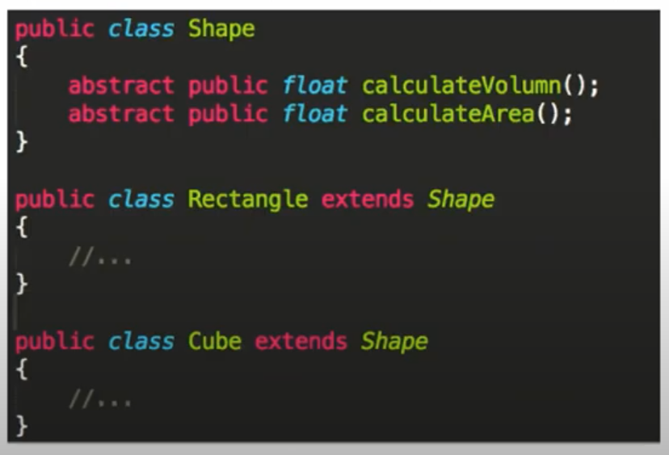
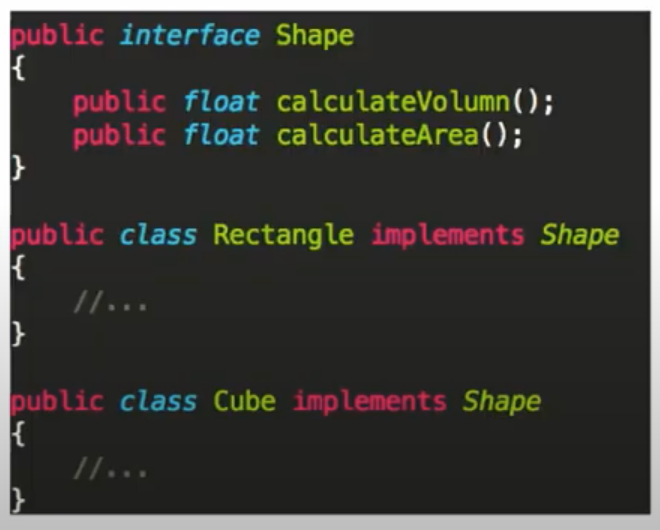
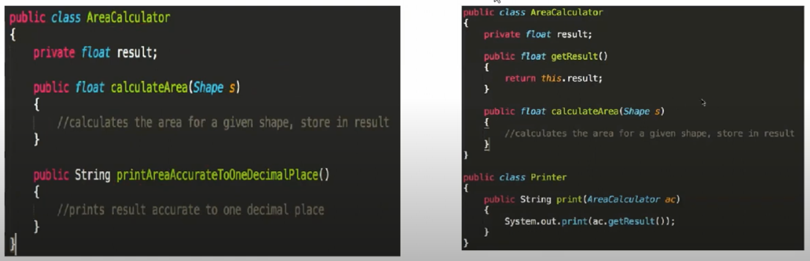

[九章OOD视频](https://youtube.com/playlist?list=PLE8VCSRk2Dy_WE7VROdJigQJuQqiboTiU)

- [典型题目](#典型题目)
- [5C 解题法](#5c-解题法)
  - [Clarify](#clarify)
  - [Core objects](#core-objects)
    - [Access modifier](#access-modifier)
  - [Use Cases](#use-cases)
  - [Classes](#classes)
  - [Correctness](#correctness)
- [SOLID原则](#solid原则)
    - [Single responsibility principle 单一责任原则](#single-responsibility-principle-单一责任原则)
  - [Open close principle 开放封闭原则](#open-close-principle-开放封闭原则)
  - [Liskov substitution principle 里氏替换原则](#liskov-substitution-principle-里氏替换原则)
  - [Interface segregation principle 接口分离原则](#interface-segregation-principle-接口分离原则)
  - [Dependency inversion principle 依赖反转原则](#dependency-inversion-principle-依赖反转原则)
- [典型错误](#典型错误)
  
# 典型题目 

Elevator, Parking lot, Restaurant,

# 5C 解题法

1. [Clarify](#clarify): 不断和面试官clarify，去除题目歧义，确定答题范围
2. [Core objects](#core-objects): 确定题目所涉及的类，以及类之间的映射关系
3. [Cases](#cases): 确定题目中所需要实现的场景和功能
4. [Classes](#classes): 通过类图的方式，具体填充题目所涉及的类
5. [Correctness](#correctness): 检查自己的设计，是否满足关键点

## Clarify

1. What: 根据关键词提问，大多是名字，考虑名字的属性。   
([Chapter 1](https://www.youtube.com/watch?v=7u-ebv4lVKA&list=PLE8VCSRk2Dy_WE7VROdJigQJuQqiboTiU&index=1&t=4032s))  
eg. Elevator(54'20''): 承重，客梯/货梯;
    Building(57'27''): 多处能搭乘的电梯口

2. How: 针对主题的规则提问，主动提出一些解决办法，通过面试官反应选择一个更优的。  
eg. Elevator: 
- 按下等待电梯按钮后， 哪台电梯响应？   
  - 同方向 > 静止 > 反向   
  - 一般负责奇数楼层，一般负责偶数楼层
  - ...
- 电梯运行时，哪些按键可以响应
  - 是否能按下反向的楼层 

3. Who: 
- 设计由人主导 VS 设计由系统主导
- 题目中是否有人出现 -> 确定解题范围

## Core objects

都写下来，承上启下，来自clarify的结果，成为use case的依据，为画类图打下基础。

从一个基础的 class 开始，向外 extend，

### Access modifier

1. package: 什么都不声明 -> `variable` 和 `function` 都是 `package level visible` (避免使用)
2. public: `variable` 和 `function` 都是 `public level visible` 【类图中的表示 +】
3. private: `variable` 和 `function` 都是 `class level visible` -> 封装的重要手段 【-】
4. protected: `variable` 和 `function` 在能被当前类访问的同时，还可以被其子类访问 【#】

## Use Cases

写下要实现的功能，一个一个case实现，最后用它检查。   

eg. Elevator
- take external / internal request
- open / close gate
- check weight

## Classes

class diagram 类图
- 遍历所有 `use cases`
- 对所有 `use cases`，详细描述这个 `use cases` 在做什么事情
- 针对这个描述，在已有的 `core objects` 里填充所需要的信息

使用Exception

## Correctness

- Validate use cases
- Follow good practice
- SOLID 原则 (single, open)
- Design pattern

# SOLID原则

### Single responsibility principle 单一责任原则

一个class应该只有一个功能。  
eg. `class AreaCalculator` -> 只应该计算面积，不应有其他功能，如print。

## Open close principle 开放封闭原则

对象或实体应该对扩展开放，对修改封闭(open to extension, close to modification)。  
eg. `class AreaCalculator` -> 若增加不同形状的图形，***不应该*** 不断修改增加函数如`calculate(Triangle t) / calculate(Rectangle r)`, 对`class AreaCalculator`应该是一个 ***general*** 的类，如其函数可以为 `calculate(Shape s)`.

## Liskov substitution principle 里氏替换原则

任何一个子类或者派生类应可以替换他们的基类或者父类。   
eg.  任何一个子类或者派生类应该完全符合其基类或者父类的特性, 能够执行父类的所有功能函数。  
 `Rectangle` 不具有体积，无法执行`calculateVolumn()`函数。

## Interface segregation principle 接口分离原则

不应该强迫一个类实现它用不上的接口。(有点类似上一个的情况)   

## Dependency inversion principle 依赖反转原则

抽象不应该依赖于具体实现，具体实现应该依赖于抽象。   

eg. 当增加一个新的形状如 `cicle`，我们建立一个新的类 `class Circle`，该类`Circle implement interface Shape`，对于`interface`，每个 class 必须重写 `interface` 里面的 ***所有函数***。此时抽象类 `interface Shape` 并不依赖于Shape是什么样子的，但对每个形状依赖于 `interface Shape` 所拥有的函数。

一个class 可以 implement 很多 interface，但是只能 extend 一个 class（父类）。

# 典型错误

1. 先下手为强，自说自话 -> 主动和面试官交流获取有效信息
2. 指鹿为马 Algo, OOD, SD 傻傻分不清楚 -> 和面试官clarify清楚题意
3. 朝出夕改，思路混乱 -〉 先呈现一个viable的成果，再慢慢修改，而不是一边做一边修改
4. 虎头蛇尾 -> 使用 cases 检查设计是否满足需求

