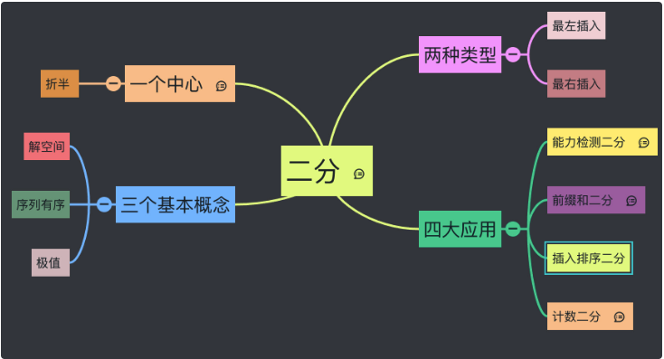

- [Binary Search](#binary-search)
  - [Hints to use](#hints-to-use)
  - [Complexity](#complexity)
  - [总结](#总结)
  - [基本模板](#基本模板)
    - [寻找目标值](#寻找目标值)
    - [寻找最左边界](#寻找最左边界)
    - [寻找最右边界](#寻找最右边界)
  - [题型分类](#题型分类)
    - [二维数组](#二维数组)
    - [二叉搜索树](#二叉搜索树)
    - [局部有序(先降后升或先升后降)](#局部有序先降后升或先升后降)
    - [自己构造有序序列(难度高, 需要观察)](#自己构造有序序列难度高-需要观察)
    - [找最值](#找最值)
    - [找极值(求第 k 大/小的数)](#找极值求第-k-大小的数)
  - [二分法四大应用技巧](#二分法四大应用技巧)
    - [能力检测（普通二分的泛化）](#能力检测普通二分的泛化)
    - [计数二分（普通二分的泛化）](#计数二分普通二分的泛化)
    - [前缀和二分（构建有序序列）](#前缀和二分构建有序序列)
    - [插入排序二分（构建有序序列）](#插入排序二分构建有序序列)
  - [题目推荐](#题目推荐)
  - [Reference](#reference)


# Binary Search
 
二分查找又称折半搜索算法。 狭义地来讲，二分查找是一种在有序数组查找某一特定元素的搜索算法。这同时也是大多数人所知道的一种说法。实际上， 广义的二分查找是将问题的规模缩小到原有的一半。类似的，三分法就是将问题规模缩小为原来的 1/3。   

**关键点:**
- 根据什么条件
- 舍弃哪部分



## Hints to use

1. 排序数组 (30% - 40%) (如果无序考虑排序，注意排序算法的时间复杂度)
2. 找比 O(N)更小时间复杂度算法 (99%)
3. 找到数组中的某个位置，使得左或右某半部分不满足条件(100%)
4. 找到一个最大/最小值使某个条件被满足(90%)
5. 两段有序数组, 第k小？
33 153 1095 852

## Complexity

- 平均时间复杂度： $O(logN)$
- 最坏时间复杂度： $O(logN)$
- 最优时间复杂度： $O(1)$
- 空间复杂度
  - 迭代：$O(1)$
  - 递归：$O(logN)$（无尾调用消除）

## 总结
1. 先定义***解空间***, 即 left 和 right 的初始值; （非常重要）
2. 根据题意确定循环结束条件  
   - 取 mid 和 target 做对比（可能是要找的，可能是数组第一个 / 最后一个） （非常重要）
   - 如果是整体有序通常只要比较 nums[mid]和 target, 若局部有序则要和特定元素比较 -> 加特定条件    
   - 因为这个模板定义是 left <= right, 通常只要想当 mid == target, left == right 时, 收缩是否能排除 来确定 right = mid 还是 mid + 1 以及 return ❓
3. 根据比较的结果收缩区间，放弃非法解（也就是二分）
4. 注意***是否有无重复元素***  （非常重要）

## 基本模板

- [寻找目标值](#寻找目标值)
- [寻找最左边界](#寻找最左边界)
- [寻找最右边界](#寻找最右边界)
  
### 寻找目标值

- 搜索 [left, right]
- 终止条件: left <= right
- 循环内, 比较 nums[mid] 和 target :
  - 如果arr[mid] == target, 返回mid;
  - 如果arr[mid] > target, 说明答案区间在 [left, mid - 1]: right = mid - 1;
  - 如果arr[mid] < target, 说明答案区间在 [mid + 1, right]: left = mid + 1;
- 找不到, 则返回-1;
  
题目: 
- [704. Binary Search](https://leetcode.com/problems/binary-search/)
- [33. Search in Rotated Sorted Array](https://leetcode.com/problems/search-in-rotated-sorted-array/)  


```java
// 最基本的模板
class Solution {
    public int search(int[] nums, int target) {
        int l = 0, r = nums.length - 1; // 搜索 [left, right]
        while (l <= r) {    // 这种 <= 的条件下，不可能出现l = mid 或 r = mid
            int mid = l + (r - l) / 2;  // 防止 r+l overflow
            if (nums[mid] == target)
                return mid;
            else if (nums[mid] > target)    
                r = mid - 1;    // 答案区间在 [left, mid - 1]
            else 
                l = mid + 1;    // 答案区间在 [mid + 1, right]
        }
        return -1;              // 没找到
    }
}
```


***最左插入和最右插入可以结合使用从而求出有序序列中和 target 相等的数的个数，这在有些时候会是一个考点。*** - > 找到最左最右边界的 index 做差。

### 寻找最左边界

- (最左二分不断收缩右边界，最终返回左边界)  
- 搜索 [left, right]
- 终止条件: left <= right
- 循环内, 比较 nums[mid] 和 target :
  - 如果arr[mid] == target, *找到可能解(备胎)，收缩右边界right = mid - 1，看看左边是否还有target*,;
  - 如果arr[mid] > target, 说明答案区间在 [left, mid - 1]: right = mid - 1;
  - 如果arr[mid] < target, 说明答案区间在 [mid + 1, right]: left = mid + 1;
- 因为终止条件是left <= right, 若存在target, 则right变化left不变, 所以最后的left是可能存在的target,需要检查left:
  - 若nums[left] != target 或者 left越界, 找不到, 则返回-1;
  - 否则返回left, 备胎转正;

题目: 
- [34. Find First and Last Position of Element in Sorted Array](https://leetcode.com/problems/find-first-and-last-position-of-element-in-sorted-array/), 
- [35. Search Insert Position](https://leetcode.com/problems/search-insert-position/)
- [268. Missing Number](https://leetcode.com/problems/missing-number/)
- [278. First Bad Version](https://leetcode.com/problems/first-bad-version/)
- [658. Find K Closest Elements](https://leetcode.com/problems/find-k-closest-elements/)
- [744. Find Smallest Letter Greater Than Target](https://leetcode.com/problems/find-smallest-letter-greater-than-target/)
- [875. Koko Eating Bananas](https://leetcode.com/problems/koko-eating-bananas/)
- [1894. Find the Student that Will Replace the Chalk](https://leetcode.com/problems/find-the-student-that-will-replace-the-chalk/)

```java
class Solution {
    public int[] firstPositionOfTarget(int[] nums, int target) {
        int l = 0, r = nums.length - 1;
        while (l <= r) {
            int mid = l + (r - l) / 2;// 防止(left + right)溢出
            
        // 若 == , mid可能是结果，但可能左边还有, 即使没有, 因为条件是l <= r, 
        // 所以一定会遍历到l, 此时l == r, nums[mid == r] < target,
        // => l = mid-1(mid == r == 之前的mid-1) + 1 = 之前的mid, left即结果
            if (nums[mid] >= target)
                r = mid - 1;    // == 时, 收缩右边界, 搜索区间变为 [left, mid-1]
            else
                l = mid + 1;    // 搜索区间变为 [mid+1, right]
        }
        // 检查是否越界
        if (left >= nums.length || nums[left] != target)
            return -1;
        return left;
    } 
}

// 常见写法
class Solution {
    int binarySearch(int[] nums, int target){
        if(nums == null || nums.length == 0)
            return -1;
        int left = 0, right = nums.length;
        while(left < right){
            int mid = left + (right - left) / 2;
            if(nums[mid] == target)
                return mid; 
            else if (nums[mid] < target) 
                left = mid + 1; 
            else  
                right = mid; 
        }
        // Post-processing:
        // End Condition: left == right
        if(left != nums.length && nums[left] == target) 
            return left;
        return -1;
    }
}
```

### 寻找最右边界

- (最右二分不断收缩左边界，最终返回右边界)
- 搜索 [left, right]
- 终止条件: left <= right
- 循环内, 比较 nums[mid] 和 target :
  - 如果arr[mid] == target, *找到可能解(备胎)，收缩左边界left = mid + 1，看看右边是否还有target*,;
  - 如果arr[mid] > target, 说明答案区间在 [left, mid - 1]: right = mid - 1;
  - 如果arr[mid] < target, 说明答案区间在 [mid + 1, right]: left = mid + 1;
- 因为终止条件是left <= right, 若存在target, 则left变化right不变, 所以最后的right是可能存在的target,需要检查right:
  - 若nums[right] != target 或者 right 越界, 找不到, 则返回-1;
  - 否则返回right, 备胎转正;

题目:  
- [34. Find First and Last Position of Element in Sorted Array](https://leetcode.com/problems/find-first-and-last-position-of-element-in-sorted-array/) (找最左最右 == target)

```java
class Solution {
    public int[] lastPositionOfTarget(int[] nums, int target) {
        int l = 0, r = nums.length - 1;
        while (l <= r) {
            int mid = l + (r - l) / 2;
        // 若 ==, mid可能是结果, 但或许右边还有, 即使没有, 因为条件是l <= r, 
        // 一定会遍历到l, 此时l == r, nums[mid == l] > target 
        // => r = mid+1(l=上次的mid+1) - 1 = 上次的mid, 所以right即结果
            if (nums[mid] <= target) 
                l = mid + 1;    // == 时收缩左边界, 搜索区间变为 [mid+1, right]
            else 
                r = mid - 1;    // 搜索区间变为 [left, mid-1]
        }
        // 检查是否越界
        if (right < 0 || nums[right] != target)
            return -1;
        return right;
    } 
}


// 常见写法
class Solution {
    public int[] lastPositionOfTarget(int[] nums, int target) {
        int l = 0, r = nums.length;
        while (l <= r) {
            int mid = l + (r - l) / 2;
            if (nums[mid] <= target) 
                l = mid + 1;   
            else 
                r = mid;    
        }
        // 检查是否越界
        if (left - 1 < 0 || nums[left - 1] != target)
            return -1;
        return left - 1;
    } 
}
```


## 题型分类

- 一维有序数组(就是前面的三个模板):
  - [找target](#寻找目标值)
  - [找最左满足条件的值](#寻找最左边界) -> 最左边界 (最左侧的值是 值 == target)
  - [找最右满足条件的值](#寻找最右边界) -> 最右边界 (最右侧的值是 值 == target)
  - [找最左插入位置](#寻找最左边界) -> 寻找最左侧 >= target 的值 // 寻找第一个 >= target 的值   
    eg. 对于[1,3,4] target = 2 来说，应该返回的是 1； 同理，对于[1,2,2,2,2,3] target = 2 来说，应该返回的是 1. 
  - [找最右插入位置](#寻找最右边界) -> 寻找最右侧 >= target 的值 // 寻找最后个 >= target 的值   
    eg. 对于[1,3,4] target = 2 来说，应该返回的是 1； 同理，对于[1,2,2,2,2,3] target = 2 来说，应该返回的是 5. 
- [二维数组](#二维数组)
- [二叉搜索树](#二叉搜索树)
- [局部有序(先降后升或先升后降)](#局部有序先降后升或先升后降)
- [自己构造有序序列(难度高, 需要观察)](#自己构造有序序列难度高-需要观察)
- [找最值](#找最值)
- [找极值(求第 k 大/小的数)](#找极值求第-k-大小的数)
  
### 二维数组

题目: 
- [74. Search a 2D Matrix](https://leetcode.com/problems/search-a-2d-matrix/)
- [240. Search a 2D Matrix II](https://leetcode.com/problems/search-a-2d-matrix-ii/) 


### 二叉搜索树

如果你用数组表示过完全二叉树，那么就很容易理解。 我们可以发现，左节点的编号都是父节点的二倍，并且右节点都是父节点的二倍 + 1。从二进制的角度来看就是：父节点的编号左移一位就是左节点的编号，左移一位 + 1 就是右节点的编号。 因此反过来， 知道了子节点的最后一位，我们就能知道它是父节点的左节点还是右节点啦。


### 局部有序(先降后升或先升后降)

题目: 
- [33. Search in Rotated Sorted Array](https://leetcode.com/problems/search-in-rotated-sorted-array/) ❤️ ❤️
- [81. Search in Rotated Sorted Array II](https://leetcode.com/problems/search-in-rotated-sorted-array-ii/) ❤️ ❤️
- [153. Find Minimum in Rotated Sorted Array](https://leetcode.com/problems/find-minimum-in-rotated-sorted-array/) 
- [154. Find Minimum in Rotated Sorted Array II](https://leetcode.com/problems/find-minimum-in-rotated-sorted-array-ii/)   

突破口: 根据mid的值, 判断 mid 在左边有序部分还是右边有序部分; 
- 若 mid < left, mid 一定在右边有序部分;
- 若 mid > left, mid 一定在左边有序部分;
- 判断 target 和 mid的关系 = > 收缩左边界/右边界

### 自己构造有序序列(难度高, 需要观察)   

构造有序序列两种方式(后续在四大应用中详细举例) : 
- [前缀和](#前缀和二分构建有序序列)
- [插入排序](#插入排序二分构建有序序列)


题目: 
- [BianrySearch: Triple Inversion](https://binarysearch.com/problems/Triple-Inversion)
- 


### 找最值

题目:
- [153. Find Minimum in Rotated Sorted Array](https://leetcode.com/problems/find-minimum-in-rotated-sorted-array/)
- [875. Koko Eating Bananas](https://leetcode.com/problems/koko-eating-bananas/)


### 找极值(求第 k 大/小的数)

题目: 
- [BianrySearch: Kth Pair Distance](https://binarysearch.com/problems/Kth-Pair-Distance) (计数二分)
  
```java
// ds 

```


## 二分法四大应用技巧


- [能力检测（普通二分的泛化）](#能力检测普通二分的泛化)
- [计数二分（普通二分的泛化）](#计数二分普通二分的泛化)
- [前缀和二分（构建有序序列）](#前缀和二分构建有序序列)
- [插入排序二分（构建有序序列）](#插入排序二分构建有序序列)

### 能力检测（普通二分的泛化）

题目:  
- [875. Koko Eating Bananas](https://leetcode.com/problems/koko-eating-bananas/description/) 
- [475. Heaters](https://leetcode.com/problems/heaters/) 
- [778. Swim in Rising Water](https://leetcode.com/problems/swim-in-rising-water/)  
- [BinarySearch: Minimum Light Radius](https://binarysearch.com/problems/Minimum-Light-Radius)

能力检测二分一般是：定义函数 isPossible， 参数是 mid，返回值是布尔值。外层根据返回值调整”解空间”。   
和最左最右二分这两种最最基本的类型相比，能力检测二分只***是将 while 内部的 if 语句调整为了一个函数罢了***。因此能力检测二分也分最左和最右两种基本类型。

示例代码（以最左二分为例）：
```python
def ability_test_bs(nums):
  def possible(mid):
    pass
  l, r = 0, len(A) - 1
  while l <= r:
      mid = (l + r) // 2
      # 只有这里和最左二分不一样
      if possible(mid): l = mid + 1
      else: r = mid - 1
  return l
```


### 计数二分（普通二分的泛化）

题目: 
- [Binary Search: Kth Pair Distance](https://binarysearch.com/problems/Kth-Pair-Distance)
- [719. Find K-th Smallest Pair Distance](https://leetcode.com/problems/find-k-th-smallest-pair-distance/)

计数二分本质也是能力检测, 基本就是求第 k 大（或者第 k 小）的数。其核心思想是找到一个数 x，使得小于等于 x 的数恰好有 k 个。
直接看代码会清楚一点：
```python
def count_bs(nums, k):
  def count_not_greater(mid):
    pass
  l, r = 0, len(A) - 1
  while l <= r:
      mid = (l + r) // 2
      # 只有这里和最左二分不一样
      if count_not_greater(mid) > k: r = mid - 1
      else: l = mid + 1
  return l
```
可以看出只是将 possible 变成了 count_not_greater，返回值变成了数字而已。

实际上，我们可以将上面的代码稍微改造一下，使得两者更像：

```python
def count_bs(nums, k):
  def possible(mid, k):
    # xxx
    return cnt > k
  l, r = 0, len(A) - 1
  while l <= r:
      mid = (l + r) // 2
      if possible(mid, k): r = mid - 1
      else: l = mid + 1
  return l
```


### 前缀和二分（构建有序序列）

题目:  
- [327. Count of Range Sum](https://leetcode.com/problems/count-of-range-sum/), 用到 merge sort + divide & conqure
构建有序数组： 分治 -> 保证index不乱的同时还能把数组划分成俩升序数组

如果数组全是正的，那么其前缀和就是一个严格递增的数组，基于这个特性，我们可以在其之上做二分。也可以在前缀和头部增加[0]简化 i-1 的判断。

### 插入排序二分（构建有序序列）

题目: 
- [剑指 Offer 51. 数组中的逆序对](https://leetcode.cn/problems/shu-zu-zhong-de-ni-xu-dui-lcof/)
- [327. Count of Range Sum](https://leetcode.com/problems/count-of-range-sum)
- [493. Reverse Pairs](https://leetcode.com/problems/reverse-pairs/)

除了上面的前缀和之外，我们还可以自行维护有序序列。不断插入并维护序列有序，进而利用有序做一些事情。一般有两种方式：
- 直接对序列排序。

代码表示：
```java
nums.sort()
bisect.bisect_left(nums, x) # 最左二分
bisect.bisect_right(nums, x) # 最右二分
```

- 遍历过程维护一个新的有序序列，有序序列的内容为 ***已经遍历过的值的集合***;
  
比如无序数组 [3,2,10,5]，遍历到索引为 2 的项（也就是值为 10 的项）时，我们构建的有序序列为 [2,3,10]。

注意我描述的是有序序列，并不是指数组，链表等具体的数据结构。而实际上，这个有序序列很多情况下是平衡二叉树。后面题目会体现这一点。

代码表示：
```java
d = SortedList()
for a in A:
    d.add(a) # 将 a 添加到 d，并维持 d 中数据有序
```
上面代码的 d 就是有序序列。

## 题目推荐

- [875. Koko Eating Bananas](https://leetcode.com/problems/koko-eating-bananas/)
- [300. Longest Increasing Subsequence](https://leetcode.com/problems/longest-increasing-subsequence/description/)  [lucifer讲解](https://lucifer.ren/blog/2020/06/20/LIS/)
- [354. Russian Doll Envelopes](https://leetcode.com/problems/russian-doll-envelopes/)
- [面试题 17.08. 马戏团人塔](https://leetcode.cn/problems/circus-tower-lcci/)

> 后面三个题建议一起做


*特别需要注意的是**有无重复元素**对二分算法影响很大，我们需要小心对待。*


## Reference  
[易潇](https://github.com/lilyzhaoyilu/LeetCode-Notes/blob/master/NotesBasedOnCategories/Binary%20Search.md)   
[易潇updated](https://github.com/lilyzhaoyilu/LeetCode-Notes/blob/master/NotesBasedOnCategories/Binary%20Search%20Updated.md)   
[91讲义](https://github.com/azl397985856/leetcode/blob/master/91/binary-search.md)     
[lucifer二分（上）](https://lucifer.ren/blog/2021/03/08/binary-search-1/)      
[lucifer二分（下）](https://lucifer.ren/blog/2021/03/23/binary-search-2/)        
[labuladong](https://labuladong.github.io/algo/2/20/29/)