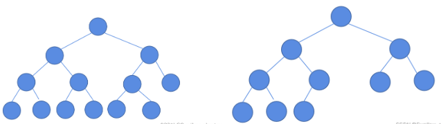
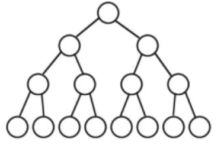
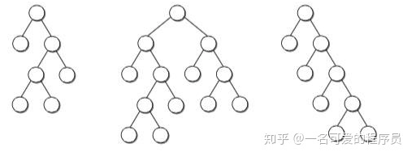

[易潇](https://github.com/lilyzhaoyilu/LeetCode-Notes/blob/master/NotesBasedOnCategories/Binary%20Tree.md)     
[lucifer](https://leetcode-solution-leetcode-pp.gitbook.io/leetcode-solution/thinkings/tree)    
[lucifer-github](https://github.com/azl397985856/leetcode/blob/master/thinkings/tree.md)

- [BFS](#bfs)
  - [Approaches](#approaches)
  - [Scenarios](#scenarios)
- [DFS](#dfs)
  - [Approaches](#approaches-1)
  - [Scenarios](#scenarios-1)
- [Complexity](#complexity)
- [题型](#题型)
  - [构建类题](#构建类题)
  - [搜索类题](#搜索类题)
  - [修改类题](#修改类题)
- [Basic knowledge](#basic-knowledge)
  - [delete node(BST)](#delete-nodebst)
  - [树的种类](#树的种类)

遍历(path)、构造、delete node、recover tree、判断validate tree、balanced/depth、 diameter、 next pointer、


## BFS
**BFS 的核心在于求最短问题时候可以提前终止。**

### Approaches
Iterative with queue (FIFO). (level traversal)

```java
// BFS, preorder
class Solution {
    public List<Integer> preorderTraversal(TreeNode root) {
        List<Integer> res = new ArrayList<>();
        Deque<TreeNode> s = new LinkedList<>();
        if (root != null) s.push(root);
        while (!s.isEmpty()) {
            TreeNode curr = s.pop();
            res.add(curr.val);
            if (curr.right != null) 
                s.push(curr.right);
            if (curr.left != null)
                s.push(curr.left);
        }
        return res;
    }
}
 // BFS, inorder
 class Solution {
    public List<Integer> inorderTraversal(TreeNode root) {
        List<Integer> res = new ArrayList<>();
        Deque<TreeNode> s = new LinkedList<>();
        TreeNode curr = root;
        while (curr != null || !s.isEmpty()) {
            while (curr != null) {
                s.push(curr);
                curr = curr.left;
            }
            curr = s.pop();
            res.add(curr.val);
            curr = curr.right;
        }
        return res;
    } 
}
// BFS, postorder
class Solution {
    public List<Integer> postorderTraversal(TreeNode root) {
        List<Integer> res = new ArrayList<>();
        Deque<TreeNode> s = new LinkedList<>();
        TreeNode curr = root, prev = null;  // prev记录上一个放进res的node;
        while (curr != null || !s.isEmpty()) {
            while (curr != null) {
                s.push(curr);
                curr = curr.left;
            }
            curr = s.pop();
            // 无右子树 / 右子树已经放入res
            if (curr.right == null || curr.right == prev) { 
                res.add(curr.val);
                prev = curr;
                curr = null;    // 其自身和左右子树都已放入res, 下一个应该是s.pop()
            } else {
                s.push(curr);
                curr = curr.right;
            }
        }
        return res;
    }
}
```
### Scenarios


## DFS

### Approaches
Recursive with stack (LIFO).
- preorder;
- inorder;
- postorder; 

```java
// DFS, preorder
class Solution {
    List<Integer> res = new ArrayList<>();
    public List<Integer> preorderTraversal(TreeNode root) {
        if (root == null) return res;
        res.add(root.val);
        preorderTraversal(root.left);
        preorderTraversal(root.right);
        return res;
    }
}
// DFS, inorder
class Solution {
    public List<Integer> inorderTraversal(TreeNode root) {
        List<Integer> res = new ArrayList<>();
        dfs(root, res);
        return res;
    }
    public void dfs(TreeNode root, List<Integer> res) {
        if (root == null) return;
        dfs(root.left, res);
        res.add(root.val);
        dfs(root.right, res);
    }
}
// DFS, postorder
class Solution {
    public List<Integer> postorderTraversal(TreeNode root) {
        List<Integer> res = new ArrayList<>();
        dfs(root, res);
        return res;
    }
    public void dfs(TreeNode root, List<Integer> res) {
        if (root == null) return;
        dfs(root.left, res);
        dfs(root.right, res);
        res.add(root.val);
    }
}
```

### Scenarios


## Complexity
Time: 
- Both of them are O(N), since one has to visit all nodes.  
     
Space:   
- DFS: O(H), H is a tree height, worst-case scenarios: O(N) ***skewed tree***, height = n.   
- BFS: O(D), D is a tree diameter; worst-case scenarios: O(N) ***complete tree***, diameter = n/2(leaf).


## 题型

### 构建类题
reference: https://lucifer.ren/blog/2020/02/08/%E6%9E%84%E9%80%A0%E4%BA%8C%E5%8F%89%E6%A0%91%E4%B8%93%E9%A2%98/

1. 给定两个DFS的遍历的结果数组，构建出原始树结构
   - [105. Construct Binary Tree from Preorder and Inorder Traversal](https://leetcode.com/problems/construct-binary-tree-from-preorder-and-inorder-traversal/)
   - [106. Construct Binary Tree from Inorder and Postorder Traversal](https://leetcode.com/problems/construct-binary-tree-from-inorder-and-postorder-traversal/)
   - [889. Construct Binary Tree from Preorder and Postorder Traversal](https://leetcode.com/problems/construct-binary-tree-from-preorder-and-postorder-traversal/)
2. 给定一个BFS的遍历的结果数组，构建出原始树结构
3. 给你描述一种场景，让你构造一个符合条件的二叉树


### 搜索类题
DFS or BFS
核心：开始点，结束点，目标

1. 最基础的前序、中序、后序遍历：
   - [144. Binary Tree Preorder Traversal](https://leetcode.com/problems/binary-tree-preorder-traversal/)
   - [94. Binary Tree Inorder Traversal](https://leetcode.com/problems/binary-tree-inorder-traversal/)
   - [145. Binary Tree Postorder Traversal](https://leetcode.com/problems/binary-tree-postorder-traversal/)
  
2. LCA (lowest common ancestor)
   - [235. Lowest Common Ancestor of a Binary Search Tree](https://leetcode.com/problems/lowest-common-ancestor-of-a-binary-search-tree/)
   - [236. Lowest Common Ancestor of a Binary Tree](https://leetcode.com/problems/lowest-common-ancestor-of-a-binary-tree/)
   - [1644. Lowest Common Ancestor of a Binary Tree II](https://leetcode.com/problems/lowest-common-ancestor-of-a-binary-tree-ii/)
   - [1650. Lowest Common Ancestor of a Binary Tree III](https://leetcode.com/problems/lowest-common-ancestor-of-a-binary-tree-iii/)
   - [1676. Lowest Common Ancestor of a Binary Tree IV](https://leetcode.com/problems/lowest-common-ancestor-of-a-binary-tree-iv/)
3. path类题目


### 修改类题


## Basic knowledge

### delete node(BST)
BST删除节点：
1. 没有子树，直接删
2. 只有左子树或右子树，左子树或右子树直接成为root
3. 左右子树都有，左子树的最右节点predecessor / 右子树的最左节点sucessor成为root

### 树的种类
- Complete Binary Tree(完全二叉树)
除了最后一层之外的其他每一层都被完全填充，并且所有结点都保持向左对齐。



- Perfect Binary Tree(完美二叉树)
除了叶子结点之外的每一个结点都有两个孩子，每一层(当然包含最后一层)都被完全填充。



- Full Binary Tree(满二叉树)
   - 国内：如果每一个层的结点数都达到最大值，则这个二叉树就是满二叉树。就是完美二叉树。
   - 国外：除了叶子结点之外的每一个结点都有两个孩子结点。




