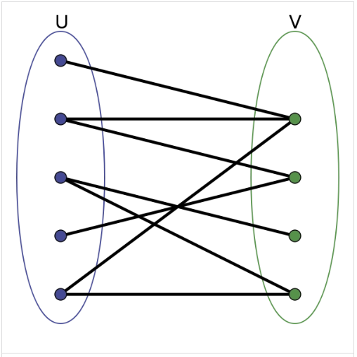
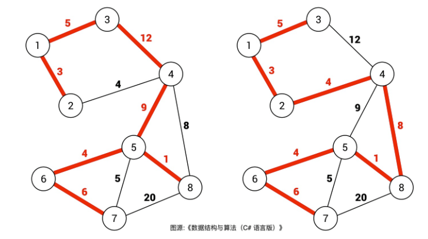
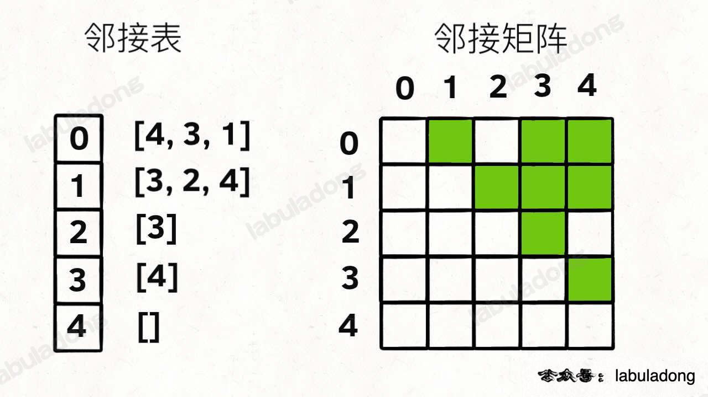

- [图的一些概念](#图的一些概念)
  - [基本概念](#基本概念)
    - [Reference](#reference)
  - [二分图](#二分图)
    - [Hint to Use](#hint-to-use)
    - [题目](#题目)
    - [Reference](#reference-1)
  - [生成树](#生成树)
    - [最小生成树 (Minimum Spanning Tree)](#最小生成树-minimum-spanning-tree)
    - [Reference](#reference-2)
- [图的建立](#图的建立)
  - [邻接表 Adjacency List](#邻接表-adjacency-list)
  - [邻接矩阵](#邻接矩阵)
- [图的遍历](#图的遍历)
  - [BFS](#bfs)
  - [DFS](#dfs)
    - [Memorized DFS](#memorized-dfs)
- [图的常见算法](#图的常见算法)
  - [环检测和拓扑排序(Topological Sort)](#环检测和拓扑排序topological-sort)
  - [并查集(Union Find)](#并查集union-find)
    - [Reference](#reference-3)
  - [Kruskal 算法](#kruskal-算法)
  - [Prim 算法](#prim-算法)
  - [Dijkstra算法](#dijkstra算法)
- [Reference](#reference-4)

## 图的一些概念

### 基本概念

- 点 vertice / vertex : 代表事物
- 链接 / 边 link / edge : 代表事物间的关系 图论是一种表示多对多关系的数据结构。 图是由顶点和边组成的，可以无边，但至少有一个顶点。
- 无向图 & 有向图  
  Undirected Graph : 两个事物间的关系是有方向的。  
  Deriected Graph : 两个事物间的关系是没有方向的。   
  (v, w) 表示无向边，即 v 和 w 是互通的   
  <v, w> 表示有向边，该边始于 v，终于 w

- 有权图 & 无权图   
  Weighted Graph : 每条边具有一定的权重(weight)，通常是一个数字
  Unweighted Graph : 条边均没有权重，也可以理解为权重为 1

- 路径 & 环  
  有环图 Cyclic Graph : 从某一个点出发，一定能够回到起点，则该图中一定有环，即有环图   
  无环图 Acyclic Graph : 与之相反

- 入度 & 出度 & 度  
  度 (Degree) : 所有与它连接点的个数之和。   
  入度 (indegreee) : 如果一个节点 x 被 b 条边所指，则称节点 x 的入度为 b   
  出度 (outdegree) : 如果一个节点 x 有 a 条边指向别的节点，则称节点 x 的出度为 a   

- 连通图 & 强连通图  
  连通图 Connected Graph : 在无向图中，任意两个顶点都有路径相通   
  强连通图 Strong Connected Graph : 在有向图中，任意两个顶点都有路径相通   

***连通性的性质***
- 自反性(自己和自己), 
- 对称性, 
- 传递性;

#### Reference
[lucifer](https://lucifer.ren/blog/2021/11/09/grapth/)   
[labuladong](https://labuladong.github.io/algo/2/22/)   


### 二分图
设G=(V,E)是一个无向图，如果顶点V可分割为两个互不相交的子集(A,B)，并且图中的每条边（i，j）所关联的两个顶点 i 和 j 分别属于这两个不同的顶点集(i in A, j in B)，则称图G为一个二分图。(有的node可能不和任何人相连, 只要不同颜色的在两个集合即可。)  




#### Hint to Use
- 经典的着色问题; 
- 分成两个阵营;


#### 题目
- [785. Is Graph Bipartite?](https://leetcode.com/problems/is-graph-bipartite/)
- [886. Possible Bipartition](https://leetcode.com/problems/possible-bipartition/)


#### Reference
[labuladong](https://labuladong.github.io/algo/2/22/52/)

### 生成树
生成树是含有图中所有顶点的 **「无环连通子图」** ->  一个连通子图，它含有图中全部 n 个顶点，但只有足以构成一棵树的 n-1 条边。一颗有 n 个顶点的生成树有且仅有 n-1 条边，如果生成树中再添加一条边，则必定成环。  
在连通网的所有生成树中，所有边的代价和最小的生成树，称为***最小生成树***，其中代价和指的是所有边的权重和。

#### 最小生成树 (Minimum Spanning Tree)



对于加权图，每条边都有权重，所以每棵生成树都有一个权重和。比如上图，右侧生成树的权重和显然比左侧生成树的权重和要小。
最小生成树，是所有可能的生成树中，权重和最小的那棵生成树就叫「最小生成树」。

#### Reference
[labuladong](https://labuladong.github.io/algo/2/22/54/)

## 图的建立

邻接表 VS 邻接矩阵




### 邻接表 Adjacency List

```java
public void buildGraph(List<Integer>[] graph, int[][] realtion) {
        for (int i =0; i < graph.length; i++)
            graph[i] = new LinkedList<>();
        for (int i = 0; i < relation.length; i++) {
            // 无向图: 两行code都要写, 
            // 有向图: 根据依赖关系只执行其中一个
            graph[relation[i][0]].add(relation[i][1]); 
            graph[relation[i][1]].add(relation[i][0]);
            
        }
    }
```

### 邻接矩阵
```java

```

## 图的遍历

### BFS

```java

```

### DFS

#### Memorized DFS

- [329. Longest Increasing Path in a Matrix](https://leetcode.com/problems/longest-increasing-path-in-a-matrix/)
  
```java
class Solution {
    int[][] memo; // 保存从该点起始的最长路径, 
    int[][] dir = {{1,0}, {-1, 0}, {0, 1}, {0, -1}};
    int m = 0, n = 0;
    public int longestIncreasingPath(int[][] matrix) {
        m = matrix.length;
        n = matrix[0].length;
        int res = 0;
        memo = new int[m][n];
        for (int i = 0; i < m; i++) {
            for (int j = 0; j < n; j++) 
                res = Math.max(res, dfs(i, j, matrix));
        }
        return res;
    }

    public int dfs(int i, int j, int[][] matrix) {
        if (memo[i][j] != 0)  // 对该点起始的最长路径已经遍历过了, 直接返回
            return memo[i][j];
        memo[i][j]++;   // 从该点起始的路径长度增加1

        // 遍历其四个方向的cell, 同时不断更新以该点为起始的最长路径
        for (int k = 0; k < 4; k++) {
            int r = i + dir[k][0], c = j + dir[k][1];
            if (r >= 0 && r < m && c >= 0 && c < n && matrix[r][c] > matrix[i][j])
                memo[i][j] = Math.max(memo[i][j], dfs(r, c, matrix) + 1); 
        }
        return memo[i][j];
    }
}
```

## 图的常见算法

### [环检测和拓扑排序(Topological Sort)](../NotesBasedOnTags/Topological%20Sort.md) 


### 并查集(Union Find)

#### Reference
[labuladong](https://labuladong.github.io/algo/2/22/53/)   
[力扣加加](https://mp.weixin.qq.com/s/aHdMcSAu2cpHgRq46yW3dw)    
https://github.com/lilyzhaoyilu/LeetCode-Notes/blob/master/NotesBasedOnCategories/Union%20Find.md

### Kruskal 算法


### Prim 算法


### Dijkstra算法


## Reference
