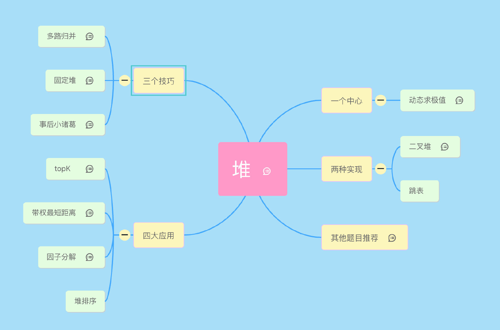
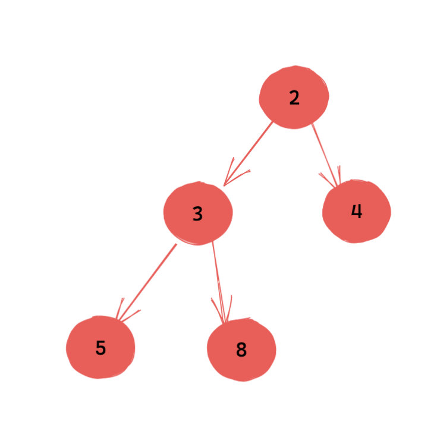
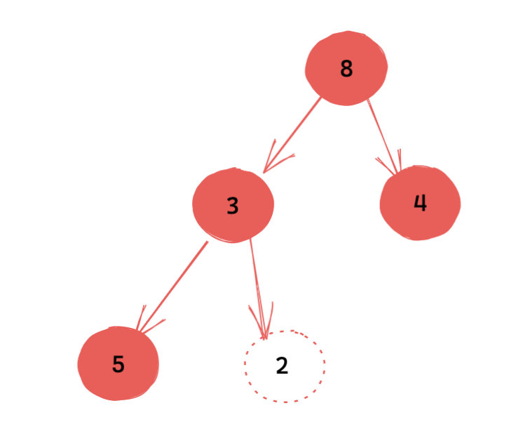
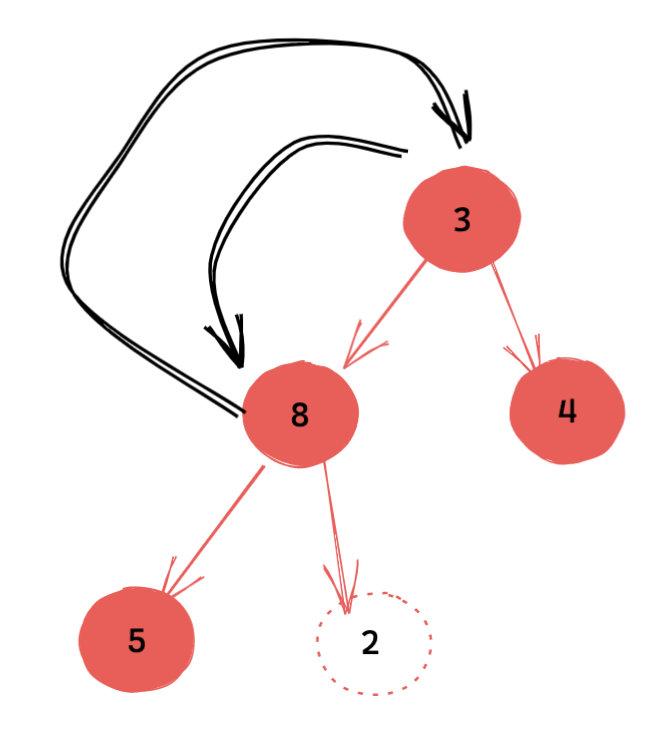
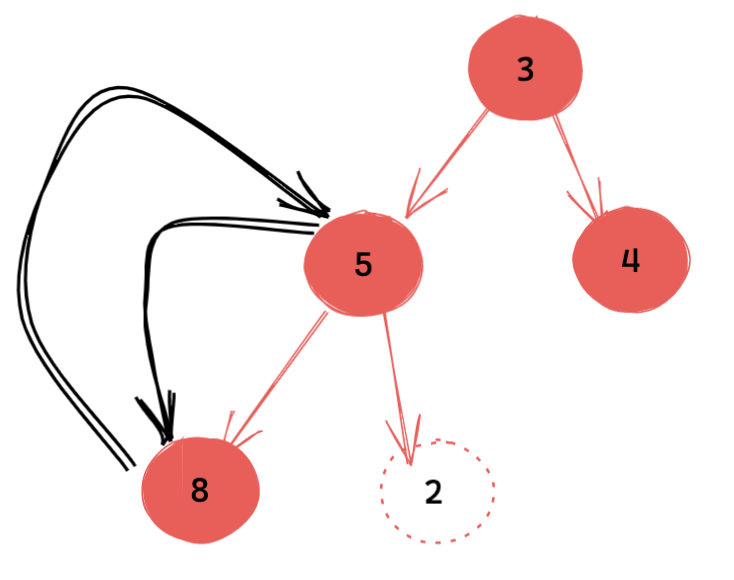
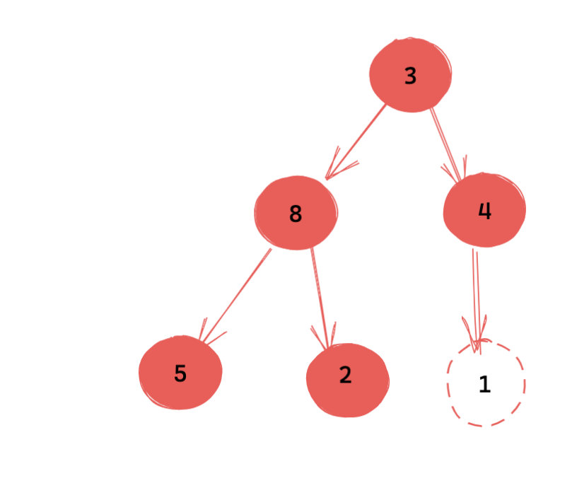
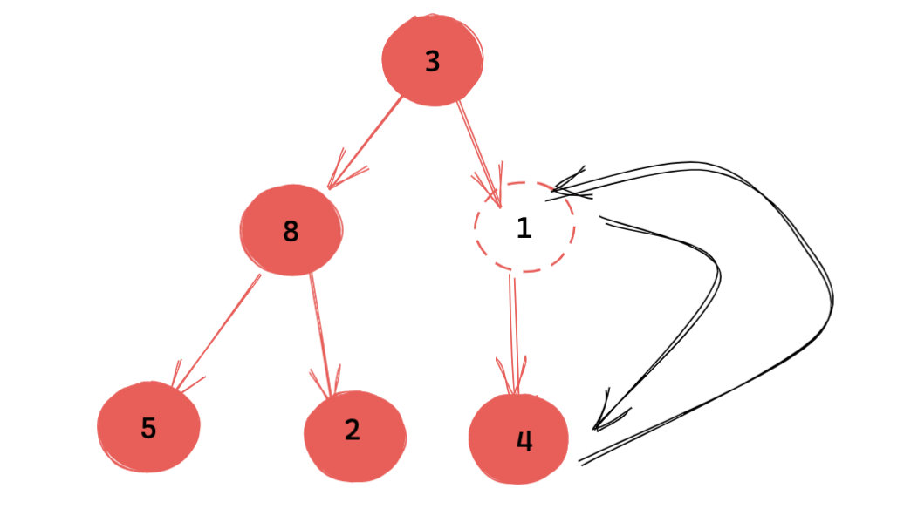
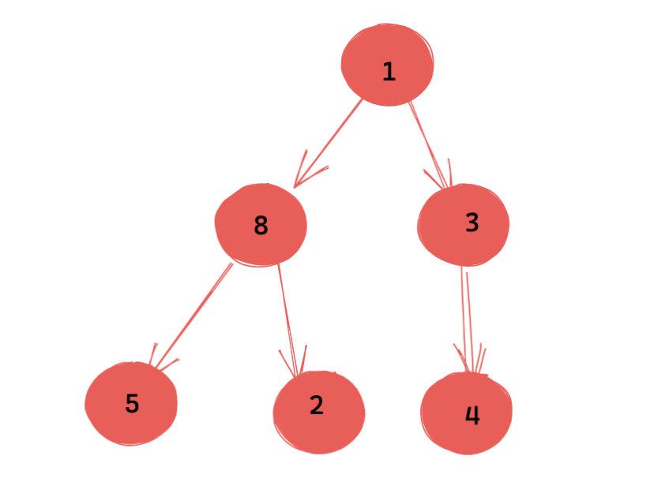
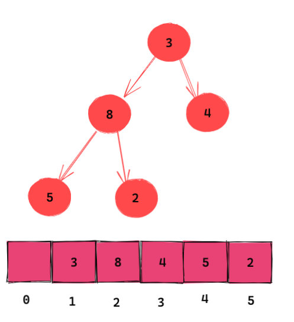

[力扣加加（上）](https://leetcode-solution-leetcode-pp.gitbook.io/leetcode-solution/thinkings/heap)   [lucifer堆（上）](https://lucifer.ren/blog/2020/12/26/heap/)   
[力扣加加（下）](https://leetcode-solution-leetcode-pp.gitbook.io/leetcode-solution/thinkings/heap-2)   [lucifer堆（下）](https://lucifer.ren/blog/2021/01/19/heap-2/)


- [核心](#核心)
- [两种实现](#两种实现)
  - [基于链表的实现- 跳表](#基于链表的实现--跳表)
  - [基于数组的实现 - 二叉堆](#基于数组的实现---二叉堆)
    - [出堆](#出堆)
    - [入堆](#入堆)
    - [实现](#实现)





## 核心

**动态求极值**。 动态和极值二者缺一不可。   
难点: ***动态*** 这个点不容易看出来。

「 什么叫动态？」   

堆只能求极值。比如能求最小值，但不能直接求第 k 小的值。
那我们是不是先求最小的值，然后将其出队。然后继续求最小的值，这个时候求的就是第 2 小了。如果要求第 k 小，那就如此反复 k 次即可。
这个过程，你会发现数据是在**动态变化**的，对应的就是堆的大小在变化。

## 两种实现

### 基于链表的实现- 跳表

### 基于数组的实现 - 二叉堆

本质上来说，二叉堆就是一颗特殊的完全二叉树。它的特殊性只体现在一点，那就是 **父节点的权值不大于儿子的权值（小顶堆）**, 那么很自然能推导出树的 **根节点就是最小值**, 这就起到了堆的取极值的作用了。

「 如何实现动态性？」   

#### 出堆

常见的操作是，把**根结点**和**最后一个结点**交换。但是新的根结点可能不满足小顶堆的性质。 这个时候，其实只需要将新的根节点下沉到正确位置即可。这里的 ***正确位置***，指的还是那句话 ***父节点的权值不大于儿子的权值（小顶堆）***。    

往下下沉的过程，其实有两个方向可供选择，是下沉到左子节点？还是下沉到右子节点？     
-> 以小顶堆来说，答案应该是 ***下沉到较小的子节点处***，

    


    



#### 入堆

我们可以直接往树的最后插入一个节点，也是叶子结点。
> 之所以这么做的其中一个原因是时间复杂度更低，因为我们是用数组进行模拟的，在数组尾部添加元素的时间复杂度为 $O(1)$。

新插入的节点可能不满足堆的性质，这一次我们需要执行上浮操作。上浮只需要拿当**前节点和父节点**进行比对就可以了， 由于省去了判断左右子节点哪个更小的过程，因此更加简单。

    

    

对于完全二叉树来说使用数组实现非常方便。因为：
- 如果节点在数组中的下标为 i，那么其左子节点下标为 $2 \times i$，右节点为 $2 \times i$+1。
- 如果节点在数组中的下标为 i，那么父节点下标为 i//2（地板除）。
- 
    

> 这要求你的数组从 1 开始存储数据。如果不是，上面的公式其实微调一下也可以达到同样的效果。不过这是一种业界习惯，我们还是和业界保持一致比较好。从 1 开始存储的另外一个好处是，我们可以将索引为 0 的位置空出来存储诸如堆大小的信息，这是一些大学教材里的做法，大家作为了解即可。

#### 实现

```java
import java.util.Arrays;
import java.util.Comparator;
/**
 * 用完全二叉树来构建 堆
 * 前置条件 起点为 1
 * 那么 子节点为  i <<1 和 i<<1 + 1
 * 核心方法为
 * shiftdown 交换下沉
 * shiftup 交换上浮
 * <p>
 * build 构建堆
 */

public class MinHeap {
    int size = 0;   // 当前含有元素个数
    int queue[];    // 可容纳元素个数在初始化是 写入, >= size

    public Heap(int capacity) {
        if (capacity < 1)
            throw new IllegalArgumentException();
        this.queue = new int[capacity];
    }

    public Heap(int[] arr) {
        size = arr.length;
        queue = new int[arr.length+1];
        int i = 1;
        for (int val: arr)
            queue[i++] = val;
    }

    public void shiftDown(int i) {
        int temp = queue[i];
        while ((i << 1) <= size ){
            int child = i << 1;
            // 判断是否有右节点, 有的话选择更小的那个child
            if (child != size && queue[child + 1] < queue[child])
                child++;
            // 和子节点比较, 比它大 -> 子节点上浮, 原节点接着下沉 直到正确位置
            if (temp > queue[child]) {   
                queue[i] = queue[child];
                i = child;
            } else break;
        }
        queue[i] = temp;
    }

    public void shiftUp(int i) {
        int temp = queue[i];
        while ( (i >> 1) > 0) { 
            // 和父节点进行比较, 比它小 -> 上浮
            if (temp < queue[i >> 1]) {
                queue[i] = queue[i >> 1];
                i >>= 1;
            } else break;
        }
        queue[i] = temp;
    }

    public void push(int val) {
        if (size == queue.length - 1)
            queue = Arrays.copyOf(queue, size << 1+1); // size * 2 * 2;
        queue[++size] = val;
        shiftUp(size);
    }

    public int pop() {
        int res = queue[1];
        queue[1] = queue[size--];
        shiftDown(1);
        return res;
    }
    
    public int peek() {
        return queue[1];
    }

    public void buildHeap() {
        for (int i = size >> 1; i > 0; i--)
            shiftDown(i);
    }

    public static void main(String[] args) {

        int arr[] = new int[]{2,7,4,1,8,1};
        Heap heap = new Heap(arr);
        heap.buildHeap();
        System.out.println(heap.peek());
        heap.push(5);
        while (heap.size > 0) {
            int num = heap.pop();
            System.out.printf(num + "");
        }
    }
}
```


题目:

- [215. Kth Largest Element in an Array](https://leetcode.com/problems/kth-largest-element-in-an-array/)
- [253. Meeting Rooms II](https://leetcode.com/problems/meeting-rooms-ii/)
- []
- []
- [1642. Furthest Building You Can Reach](https://leetcode.com/problems/furthest-building-you-can-reach/)


