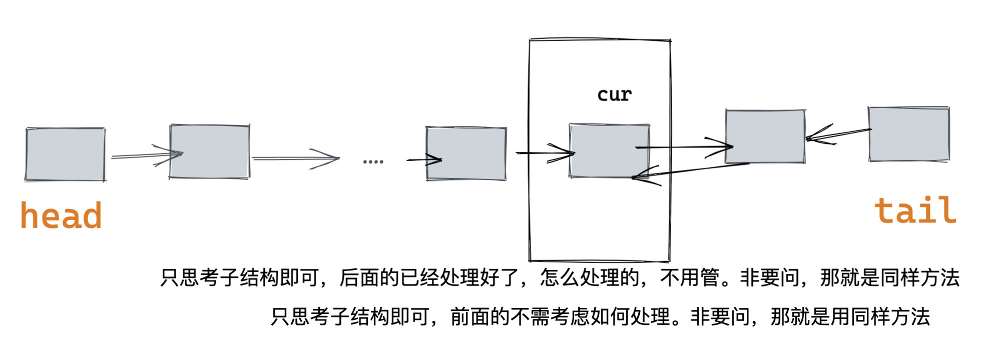

[91讲义](https://leetcode-solution.cn/solutionDetail?type=2&id=2002&max_id=2008)


- [总结](#总结)
  - [三个注意点](#三个注意点)
    - [出现环](#出现环)
    - [边界](#边界)
    - [前后序递归](#前后序递归)
      - [反转链表前序](#反转链表前序)
      - [反转链表后序](#反转链表后序)
- [简介](#简介)
- [链表的基本操作](#链表的基本操作)
  - [插入](#插入)
  - [删除](#删除)
  - [遍历](#遍历)
- [基本题型考点](#基本题型考点)
  - [反转链表(prev) + 找中点(快慢指针)](#反转链表prev--找中点快慢指针)
  - [环形链表(判断cycle, 环的起始点)](#环形链表判断cycle-环的起始点)
  - [合并链表](#合并链表)
  - [相交链表(交点)](#相交链表交点)
  - [删除 node](#删除-node)
  - [设计题](#设计题)
- [四个技巧](#四个技巧)
  - [虚拟头节点 dummy 和 prev node](#虚拟头节点-dummy-和-prev-node)
  - [快慢指针](#快慢指针)
  - [穿针引线](#穿针引线)
  - [先穿再排后判空](#先穿再排后判空)
- [Reference](#reference)


## 总结

### 三个注意点

#### 出现环 

画图是万能的！！

#### 边界

- 头节点可能被移除 -> 使用虚拟节点
- 题目返回的是一个新的head，这个时候要注意指针的变化。

#### 前后序递归

链表具有递归性。回想二叉树遍历。   
> 绝大多数的题目都是单链表，而单链表只有一个后继指针。因此只有前序和后序，没有中序遍历。 (我们以主逻辑所在的地方定义 遍历叫法。)    


***以下以反转链表为例：***

##### 反转链表前序

**如果是前序遍历，那么你可以想象前面的链表都处理好了，怎么处理不管。**

```java

// 将迭代的 reverse list 转化成递归形式
public ListNode preOrderReverse(ListNode head, ListNode pre) {
    if (head == null) return pre;
    // 保存下一个节点 (因为后面的都还没处理)
    ListNode nxt = head.next;
    // 主逻辑: 处理当前节点指向前一个node (前面的都处理好了, 所以不会有环)
    head.next = pre;
    return preOrderReverse(nxt, head);
}

preOrderReverse(head, null);
```


##### 反转链表后序

**如果是后序遍历，那么你可以想象后面的链表都处理好了，怎么处理不管。**

```Java
public ListNode postOrderReverse(ListNode head) {
    if (head == null || head.next == null) return head;
    // 后面是已经处理好的,
    ListNode newHead = postOrderReverse(head.next);
    // 主逻辑: 处理当前节点
    head.next.next = head;
    head.next = null;
    return newHead;
}
```





## 简介
- linked list（val: 存储数据的数据域，next: 存储下一个节点指针的指针域。） 
```java
// Definition for singly-linked list.
public class ListNode {
    int val;
    ListNode next;
    ListNode() {}
    ListNode(int val) { 
        this.val = val; 
    }
    ListNode(int val, ListNode next) { 
        this.val = val; 
        this.next = next;
    }
 }
 ```

- doubly linked list (val: 存储数据的数据域，next: 存储下一个节点指针的指针域，pre: 存储上一个节点指针的指针域。) 空间换时间。支持O(1)定位删减。
  
```java
class ListNode {
    public int val;
    public ListNode prev;
    public ListNode next;

    public ListNode() {}

    public ListNode(int _val) {
        val = _val;
    }

    public ListNode(int _val,Node _prev,Node _next) {
        val = _val;
        prev = _prev;
        next = _next;
    }
};
```


## 链表的基本操作

### 插入

```Java
ListNode nxt = cur.next;
cur.next = insertNode;
insertNode.next = nxt;
```

### 删除
```Java
cur.next = cur.next.next;
```

### 遍历
```Java
ListNode cur = head;
while (cur != null)
    cur = cur.next;
```

## 基本题型考点

### 反转链表(prev) + 找中点(快慢指针)  

善于使用 prev node.

题目：
- [206. Reverse Linked List](https://leetcode.com/problems/reverse-linked-list/)
- [876. Middle of the Linked List](https://leetcode.com/problems/middle-of-the-linked-list/)

```java
// 反转链表
class Solution {
    public ListNode reverseList(ListNode head) {
        ListNode prev = null, nxt = null;
        while (head != null) {
            nxt = head.next;
            head.next = prev;
            prev = head;
            head = nxt;
        }
        return prev;
    }
}

// Recursion
class Solution {
    public ListNode reverseList(ListNode head) {
        if (head == null || head.next == null)
            return head;
        ListNode temp = reverseList(head.next);
        head.next.next = head;  // 这里总想不起来！！！, 
        head.next = null;       // 注意这里的处理
        return temp;
    }
}

// 找中点
class Solution {
    public ListNode middleNode(ListNode head) {
        ListNode slow = head, fast = head;
        while (fast != null && fast.next != null) {
            slow = slow.next;
            fast = fast.next.next;
        }
        return slow;
    }
}
```

### 环形链表(判断cycle, 环的起始点)
1. 哈希法   
2. 快慢指针 - Floyd's Algo
   fast: 步长2, slow: 步长1, 相遇后 fast 回到 head, slow 和 fast 步长都变为1, 再次相遇的点就是环形链表入口.

题目：
- [141. Linked List Cycle](https://leetcode.com/problems/linked-list-cycle/)
- [142. Linked List Cycle II](https://leetcode.com/problems/linked-list-cycle-ii/)

```java
public class Solution {
    public ListNode detectCycle(ListNode head) {
        ListNode slow = head, fast = head;
        boolean hasCycle = false;
        // 判断环的存在
        while (fast != null && fast.next != null) {
            slow = slow.next;
            fast = fast.next.next;
            if (slow == fast){      // 找到cycle
                hasCycle = true;
                break;
            }
        }
        if (!hasCycle) return null;
        fast = head;
        while (slow != fast){   // 同步长 -> 找环的起始点
            slow = slow.next;
            fast = fast.next;
        }
        return slow;
    }
}
```

### 合并链表
使用 dummy node, 双指针遍历两个list进行合并。

题目：
- [21. Merge Two Sorted Lists](https://leetcode.com/problems/merge-two-sorted-lists/)
  
```java
// Iteration: O(n+m), O(1)
class Solution {
    public ListNode mergeTwoLists(ListNode list1, ListNode list2) {
        ListNode dummy = new ListNode(-1), cur = dummy;
        while (list1 != null && list2 != null) {
            if (list1.val <= list2.val) {
                cur.next = list1;
                list1 = list1.next;
            } else {
                cur.next = list2;
                list2 = list2.next;
            }
            cur = cur.next;
        }
        cur.next = list1 == null ? list2 : list1;
        return dummy.next;
    }
}
```

### 相交链表(交点)

1. 哈希法   
有A、B两链表，先遍历其中一个，并且存入哈希。如果遍历B的时候，遍历到哈希有的点，就是相交。

2. 双指针   
a,b 两个指针在 A、B的头部，移动速度相同。当a到达尾部，下一个到B的头部，b也同理。两人相遇的地方就是交点，否则没有交点。
因为a，b走过路程相等： a路程： A + shared + B  b路程： B + shared + A 

题目：
- [160. Intersection of Two Linked Lists](https://leetcode.com/problems/intersection-of-two-linked-lists/)
  
```java
public ListNode getIntersectionNode(ListNode headA, ListNode headB) {
    ListNode l1 = headA, l2 = headB;
    while (l1 != l2) {
        l1 = (l1 == null) ? headB : l1.next;
        l2 = (l2 == null) ? headA : l2.next;
    }
    return l1;
}
```  

如果只是判断是否存在交点，那么就是另一个问题，即 编程之美 3.6 的问题。有两种解法：

> 把第一个链表的结尾连接到第二个链表的开头，看第二个链表是否存在环 / 直接比较两个链表的最后一个节点是否相同。

### 删除 node

题目:
- [19. Remove Nth Node From End of List](https://leetcode.com/problems/remove-nth-node-from-end-of-list/)
- [82. Remove Duplicates from Sorted List II](https://leetcode.com/problems/remove-duplicates-from-sorted-list-ii/)
- [83. Remove Duplicates from Sorted List](https://leetcode.com/problems/remove-duplicates-from-sorted-list/)
  
```java
// 19. Remove Nth Node From End of List
class Solution {
    public ListNode removeNthFromEnd(ListNode head, int n) {
        // 需要找到第 len-n 的node -> 先移 n 次, 剩余正好 len-n个
        ListNode dummy = new ListNode(-1, head), cur = dummy;
        while(n-- > 0)  // 找到第 n 个
            cur = cur.next;
        
        ListNode prev = dummy;
        // 移动 len - n 次
        while (cur != null && cur.next != null) {
            prev = prev.next;
            cur = cur.next;
        }
        prev.next = prev.next.next;
        
        return dummy.next;
    }
}


// 82. Remove Duplicates from Sorted List II
class Solution {
    public ListNode deleteDuplicates(ListNode head) {
        ListNode dummy = new ListNode(-1, head); // 可能删除head
        ListNode cur = head, prev = dummy;
        while (cur != null) {
            if (cur.next != null && cur.val == cur.next.val) {
                int value = cur.val;
                while (cur != null && cur.val == value)
                    cur = cur.next;
            } else {    // 没有duplicate, 此时才移动 prev 指针
                prev = cur;
                cur = cur.next;
            }
            prev.next = cur;  // 先不移动 prev, 要再次判断当前cur是否有duplicate
        }
        return dummy.next;
    }
}
```


### 设计题

题目：
- [706. Design HashMap](https://leetcode.com/problems/design-hashmap/)
- [705. Design HashSet](https://leetcode.com/problems/design-hashset/)
- [355. Design Twitter](https://leetcode.com/problems/design-twitter/)
- [1472. Design Browser History](https://leetcode.com/problems/design-browser-history/)
- [146. LRU Cache](https://leetcode.com/problems/lru-cache/)
- [716. Max Stack](https://leetcode.com/problems/max-stack/)
- [707. Design Linked List](https://leetcode.com/problems/design-linked-list/)

## 四个技巧

- [虚拟头节点 dummy 和 prev node](#虚拟头节点-dummy-和-prev-node)
- [快慢指针](#快慢指针)
- [穿针引线](#穿针引线)
- [先穿再排后判空](#先穿再排后判空)


### 虚拟头节点 dummy 和 prev node

- 只要是 head 节点可能被修改的 -> 一定会用到 dummy node;
- prev node情景 :
  - 删除node
  - 

### 快慢指针

1. 处理环
2. 处理交点
3. 找第k个点（让一个先走几步，另一个再走）

### 穿针引线

将 某段已经反转的链表 和剩余部分拼接起来
```java
a.next = c
b.next = d
```


### 先穿再排后判空

先把穿的都写了，然后排序，最后再看需要判空不。

## Reference

[labuladong](https://labuladong.gitee.io/algo/2/19/18/)   
[lucifer链表专题](https://leetcode-solution-leetcode-pp.gitbook.io/leetcode-solution/thinkings/linked-list)    
[lucifer 公众号](https://mp.weixin.qq.com/s?__biz=MzI4MzUxNjI3OA==&mid=2247485582&idx=1&sn=eff845460e91be97026c937b229c2989&chksm=eb88c497dcff4d81e08ac30951b160f0083bc9fe5a2b64b8e1ea9e0988e14a9df2b56515f508&token=450700782&lang=zh_CN#rd)
[狗头](https://github.com/lilyzhaoyilu/LeetCode-Notes/blob/master/NotesBasedOnCategories/%E7%AC%94%E8%AE%B0LinkedList.md)   
https://github.com/CyC2018/CS-Notes/blob/master/notes/Leetcode%20%E9%A2%98%E8%A7%A3%20-%20%E9%93%BE%E8%A1%A8.md