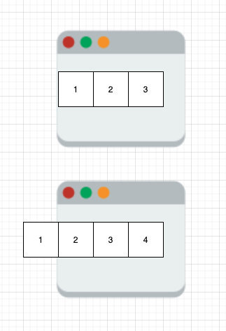
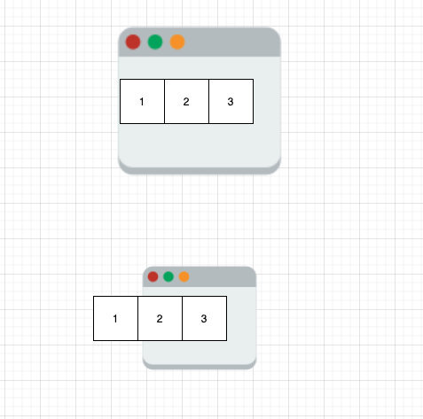

- [核心](#核心)
- [Complexity](#complexity)
- [常见使用](#常见使用)
- [常见题型](#常见题型)
- [固定窗口大小](#固定窗口大小)
- [求满足条件的最大 / 最小窗口](#求满足条件的最大--最小窗口)
  - [最大窗口](#最大窗口)
  - [最小窗口](#最小窗口)
    - [至多有K个不同的数字/字母(最大窗口)](#至多有k个不同的数字字母最大窗口)
    - [允许修改K次 -> 使得unique(只有一种字母/数字)的子串最长 (最大窗口)](#允许修改k次---使得unique只有一种字母数字的子串最长-最大窗口)
- [Reference](#reference)

## 核心

滑动窗口主要是为了解决没有 ***利用前面状态计算好的信息*** 而重新计算带来的计算复杂度增加的问题，通常用来解决一些连续问题。  很多算法都是基于这种优化思想产生的，比如前缀和。

> 如果数组不是一次性给出的，而是基于流的，那么使用滑动窗口是必须的。而流在工程中经常出现，比如我要计算一段时间内股票 k 线图，因此滑动窗口算法实际上有着非常广泛的意义。

## Complexity
Time: O(n).  
跟最内层循环主体的执行次数有关，跟多少重循环无关    
Space: O(1) / O(constant integer).

## 常见使用

1. 滑动窗口(90%)
2. 时间复杂度 O(N)（80%）
3. 原地交换，不能使用额外空间(80%)
4. ***连续*** 问题，如 subarray / substring 关键词(50%)
> 另外子数组求和要想到前缀和优化 （ 数据一定是正数 —> 保证前缀和数组是递增的 ）
5. 回文 palindrome （50%）
6. 前缀和
7. 当我们需要枚举数组中的两个元素时，如果我们发现随着第一个元素的递增，第二个元素是递减的，那么就可以使用双指针的方法，将枚举的时间复杂度从 O(N^2)减少至 O(N)。
8. 单调队列特别适合求连续区间最大值和最小值 + 滑动窗口


> 什么时候可以用滑动窗口
> 1. 求解的是连续区间的某个指标，关键词是连续
> 2. 如果考虑一个子区间，我们在其前或者后添加一个元素，会对指标的计算产生什么样的影响？换言之，我们是否可以在小区间前或者后添加一个元素后，利用已经计算好的小区间的指标去更新大区间的指标？
> 3. 如果某一个区间不合法，那么小于（或大于）其区间的也都不合法。这样我们就可以利用滑动创建左指针不回退的特点将时间复杂度降低。
> 其中第一个条件是可以使用滑动窗口的前提。第二个和第三个是滑动窗口相比与暴力枚举的能够提高性能的关键。


## 常见题型

- [固定窗口大小](#题型-固定窗口大小)
- [求满足条件的最大 / 最小窗口](#求满足条件的最大--最小窗口)  
  - [最大窗口](#最大窗口)
  - [最小窗口](#最小窗口)

总体步骤：
- 向窗口添加元素: 通过 right++ 使其满足条件
- 从窗口删除元素: 通过 left++ 打破平衡, 使其不满足条件, 以获取下一个满足条件的结果
- 更新信息: 动态窗口满足条件时适时更新需要比较的信息

**伪代码**
```java
初始化慢指针 l = 0
初始化 ans

for 快指针 r in 可迭代集合
   更新窗口内信息
   while 窗口内不符合题意
      扩展或者收缩窗口
      慢指针移动
   更新答案
返回 ans

// 大致逻辑
int left = 0, right = 0;
while (right < s.size()) {
    // 增大窗口
    window.add(s[right]);
    right++;
    // 进行窗口内数据的一系列更新
    while (window needs shrink) {
        // 缩小窗口
        window.remove(s[left]);
        left++;
        // 进行窗口内数据的一系列更新
    }
}

```

套模板时，只需要思考以下几个问题：

1. 什么时候应该移动 right 扩大窗口？窗口加入字符时，应该更新哪些数据？
2. 什么时候窗口应该暂停扩大，开始移动 left 缩小窗口？从窗口移出字符时，应该更新哪些数据？
3. 我们要的结果应该在扩大窗口时还是缩小窗口时进行更新？


## 固定窗口大小

1. left 初始化 0
2. right 初始化 right - left + 1 => 窗口大小
3. 同时移动 left、right
4. 判断窗口内元素是否满足条件   
   - 如果满足，考虑更新解
   - 如果不满足，继续移动窗口
  
<div align=center>

</div>

题目:
- [239. Sliding Window Maximum](https://leetcode.com/problems/sliding-window-maximum/) ( 队列 + 滑动窗口 )
- []


## 求满足条件的最大 / 最小窗口 

1. left, right 初始化为 0
2. right++
3. 判断窗口内连续元素是否满足条件
   - 如果满足，考虑更新解，并且移动 left
   - 如果不满足，继续 right++  
     就是 right 指针不停向右移动，left 指针仅仅在窗口满足条件之后才会移动，起到窗口收缩的效果。

<div align=center>

</div>


Longest Sublist with Absolute Difference Condition


### 最大窗口

题目：
- [3. Longest Substring Without Repeating Characters](https://leetcode.com/problems/longest-substring-without-repeating-characters/)


### 最小窗口
- [76. Minimum Window Substring](https://leetcode.com/problems/minimum-window-substring/)
- [209. Minimum Size Subarray Sum](https://leetcode.com/problems/minimum-size-subarray-sum/)


**模板代码**  

```java
// 209. Minimum Size Subarray Sum
// O(n), O(1)
class Solution {
    public int minSubArrayLen(int target, int[] nums) {
        int res = nums.length + 1, sum = 0;
        // r -> 快指针
        for (int l = 0, r = 0; r < nums.length; r++) {
            sum += nums[r]; // 更新窗口内信息
            // while窗口内信息符合要求
            while (sum >= target) {
                // 最小窗口: update检查答案 在循环里面
                res = Math.min(res, r-l+1);
                sum -= nums[l++];   // l -> 慢指针移动
            }                
        }
        return res == nums.length+1 ? 0 : res;
    }
}
```


#### 至多有K个不同的数字/字母(最大窗口)

1. 求其最长的长度(子数组/子串); 
2. 求子数组个数;
   
(k=1 没有重复的最长子串: O(n), O(min(128,s.length) )
例题: LeetCode 3, 159, 340, 904, 992,

**模板代码**    

[340. Longest Substring with At Most K Distinct Characters](https://leetcode.com/problems/longest-substring-with-at-most-k-distinct-characters/) (最大窗口)

```java
// O(n), O(k)
class Solution {
    public int atMostK(String s, int k) {
        Map<Character, Integer> cnt = new HashMap<>();
        int res = 0;
        for (int l = 0, r = 0; r < s.length(); r++) {
            char c = s.charAt(r);
            cnt.put(c, cnt.getOrDefault(c,0)+1);
            while (cnt.size() > k) {
                char ch = s.charAt(l);
                cnt.put(ch, cnt.get(ch) - 1);
                if (cnt.get(ch) == 0)
                    cnt.remove(ch);
                l++;
            }
            // 最大窗口: update在循环外面
            res = Math.max(res, r - l + 1); // 求最长子数组/子串; 
            // res += r-l+1;    // 求子数组个数
            // 每增加一个元素,此时子数组长度为m 且仍满足要求, 
            // 则符合题意的子数组个数 + m: 该元素本身+该元素和前面每个元素组成子数组
        }
        return res;
    }
}
```

```java
public int longestSub(string s, int k) {
    int maxLen = -1;
    Map<Character, Integer> map = new HashMap<>();
    int left = 0; // start index for the window
    for (int right = 0; right < s.length(); right++) {
        char c = s.charAt(right);
        if (map.getOrDefault(c, 0) == 0)
            k--;
        map.put(c, map.getOrDefault(c, 0) + 1); 
        while (k < 0) {
            char ch = s.charAt(left);
            map.put(ch, map.get(ch) - 1);
            if (map.get(ch) == 0)
                k++;
            left++;
        }
        maxLen = Math.max(maxLen, right - left + 1);
    }
    return maxLen;
}
```


#### 允许修改K次 -> 使得unique(只有一种字母/数字)的子串最长 (最大窗口)

(没有重复的最长子串: O(n), O(min(128,s.length) )  
例题: LeetCode 424, 487, 1004, 2024 

**模板代码**

[424. Longest Repeating Character Replacement](https://leetcode.com/problems/longest-repeating-character-replacement/) (最大窗口)

```java
// O(n), O(26) / O(128) 看string里都包含啥
class Solution {
    public int characterReplacement(String s, int k) {
        int mainCnt = 0, res = 0;
        int[] cnt = new int[26];
        for (int l = 0, r = 0; r < s.length(); r++) {
            char c = s.charAt(r);
            // 串里主要的字母个数
            // res最长=mainCnt+k; 所以即使之后换了mian的字母, 若mainCnt比之前小,res肯定也比之前小,就没必要计算
            mainCnt = Math.max(mainCnt, ++cnt[c-'A']);
            while (r - l + 1 - mainCnt > k) 
                cnt[s.charAt(l++)-'A']--;
            res = Math.max(res, r - l + 1);
        }
        return res;
    }
}
```


(没有重复的最长子串: O(n), O(min(128,s.length) )  
例题: LeetCode 424, 487, 1004, 2024 

**模板代码**

[424. Longest Repeating Character Replacement](https://leetcode.com/problems/longest-repeating-character-replacement/) (最大窗口)

```java

```


## Reference
[91讲义](https://github.com/xxiaomm/91Days-7.15-10.13/blob/master/%E8%AE%B2%E4%B9%89/3.%20%E4%B8%93%E9%A2%98%E7%AF%87/02.%20%E6%BB%91%E5%8A%A8%E7%AA%97%E5%8F%A3.pdf)   
[lucifer博客](https://leetcode-solution-leetcode-pp.gitbook.io/leetcode-solution/thinkings/slide-window)  
[labuladong](https://labuladong.gitee.io/algo/1/12/)  
[拓展阅读](https://leetcode.com/problems/binary-subarrays-with-sum/discuss/186683/)
