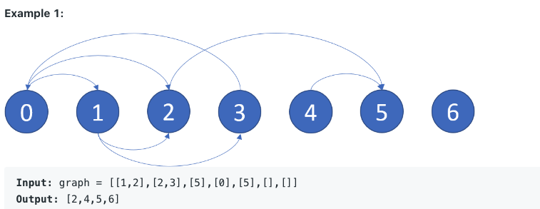
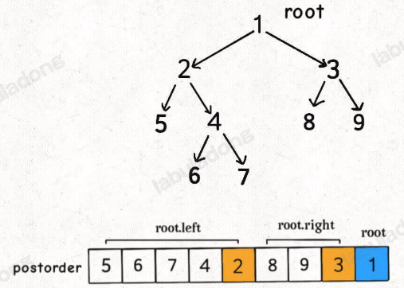

- [环检测](#环检测)
- [拓扑排序(Topological Sort)](#拓扑排序topological-sort)
  - [Hint to Use](#hint-to-use)
  - [DFS实现](#dfs实现)
  - [BFS实现](#bfs实现)
  - [题目](#题目)
  - [Reference](#reference)

## 环检测

## 拓扑排序(Topological Sort)

在 ***有向无环图DAG (Directed Acyclic Graph)*** 的前提下, 就是将图中的所有节点展开成一维序列，对于序列中任意的节点 ，如果在序列中 u 在 v 的前面，则说明在图中存在从 u 出发达到 v 的通路，即 u 排在 v 的前面。反之亦然。   
任何有向无环图至少有一个拓扑排序。已知有算法可以在线性时间内，构建任何有向无环图的拓扑排序。   
(举例: 给你一堆课程，课程之间有先修关系，找到一种上课顺序使得能修完全部课程。)

### Hint to Use
- 给定一些数据 node,  不同node之间存在依赖关系, 必须先访问被依赖的 然后才能访问下一个 node, 让你找出一种顺序能够遍历所有 node。
  【 例如, 不同课程之间的存在依赖关系, 想上某些课 必须上完其先修课, 找到一种上课顺序能够成功把所有课程修完。】    

***关键词*** : 依赖关系 -> 找到能够全部访问的方案 or not

### DFS实现
利用 DFS 的 postorder 遍历, 如图

若依赖关系是: ***child 依赖 root***, 即 root 执行完毕才能执行 child, 则需要将 postorder的结果进行***逆序转换***才是最终的结果;    
若依赖关系是: ***root 依赖 child***, 即 child 执行完毕才能执行 root, 则需要将 postorder的结果就是最终的结果;

### BFS实现
利用 node 的 indegree 「入度」实现。   

1. 根据依赖关系，构建邻接表、入度数组。
2. 选取入度为 0 的 node，根据邻接表，依赖它的那些 node 的入度 - 1。
3. 找出入度变为 0 的 node，重复第 2 步。
4. 直至所有数据的入度为 0，得到排序，如果还有数据的入度不为 0，说明图中存在环。

### 题目
- [207. Course Schedule](https://leetcode.com/problems/course-schedule/)
- [210. Course Schedule II](https://leetcode.com/problems/course-schedule-ii/)
- [269. Alien Dictionary](https://leetcode.com/problems/alien-dictionary/)
- [lintcode 127. 拓扑排序](https://www.lintcode.com/problem/127/)

### Reference
[labuladong](https://labuladong.github.io/algo/2/22/51/)
[宫水三叶](https://mp.weixin.qq.com/s?__biz=MzU4NDE3MTEyMA==&mid=2247489706&idx=1&sn=771cd807f39d1ca545640c0ef7e5baec)