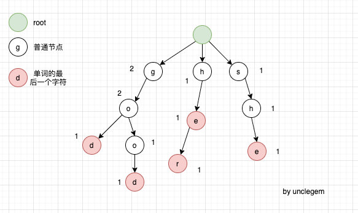

[lucifer](https://leetcode-solution-leetcode-pp.gitbook.io/leetcode-solution/thinkings/trie)   
[lucifer github](https://github.com/azl397985856/leetcode/blob/master/thinkings/trie.md)   
[labuladong](https://mp.weixin.qq.com/s/hGrTUmM1zusPZZ0nA9aaNw)

[leetcode Trie Tag](https://leetcode.com/tag/trie/)  
[力扣字典树合集](https://leetcode.cn/tag/trie/problemset/)

- [简介](#简介)
- [Hint to use](#hint-to-use)
- [字典树的数据结构](#字典树的数据结构)
  - [Java实现](#java实现)
  - [复杂度](#复杂度)
- [基础模板](#基础模板)
- [推荐题目](#推荐题目)


## 简介

字典树也叫前缀树、Trie。   
核心操作是插入，查找。  
本质是在有 ***多个相同前缀*** 的时候用空间换时间。   
常用的使用场景，比如基于前缀的模糊匹配

## Hint to use

- 查找字符串集合中是否包含 由某个前缀构成的字符
- 查找字符串合集中 由某个前缀构成的字符个数
- 字符矩阵中找单词


## 字典树的数据结构

- 节点
  - 根没有实际意义
  - 每一个节点代表一个 ***字符***
  - 节点的数据结构可以自定义，比如 isWord(是否是单词), count(该前缀出现的次数)...，具体问题具体分析

- API

  - insert(word)
  - search(word)
  - **startsWith(word)**


- 举例：  
  给出几个单词 words [she,he,her,good,god]构造出一个 Trie, 如下图：

<div align=center>  </div>

### [Java实现](#基础模板)

### 复杂度

- Time complexity: O(L), L 是字符串长度 增删查改
- Space complexity: worst case: O(N * L), N 是单词数, L是字符长度

## 基础模板

题目：
- [208. Implement Trie (Prefix Tree)](https://leetcode.com/problems/implement-trie-prefix-tree/)
- [211. Design Add and Search Words Data Structure](https://leetcode.com/problems/design-add-and-search-words-data-structure/)

```java
// 208. Implement Trie (Prefix Tree)
class Trie {
    // TrieNode 的数据结构
    private class TrieNode {
        int count;          //表示以该处节点构成的串的个数
        int preCount;       //表示以该处节点构成的前缀的字串的个数
        TrieNode[] children;

        TrieNode() {
            children = new TrieNode[26];
            count = 0;
            preCount = 0;
        }
    }

    // Trie 的数据结构
    TrieNode root;

    public Trie() {
        root = new TrieNode();
    }
    // O(L), L 是word的长度
    public void insert(String word) {
        TrieNode node = root;
        for (int i = 0; i < word.length(); i++) {
            char c = word.charAt(i);
            if (node.children[c - 'a'] == null)
                node.children[c - 'a'] = new TrieNode();

            node = node.children[c - 'a'];
            node.preCount++;
        } 
        node.count++;
    }
    // O(L), L 是word的长度
    public boolean search(String word) {
        TrieNode node = root;
        for (int i = 0; i < word.length(); i++) {
            char c = word.charAt(i);
            if (node.children[c - 'a'] == null)
                return false;
            node = node.children[c - 'a'];
        }
        return node.count > 0;
    }

    public boolean startWith(String prefix) {
        TrieNode node = root;
        for (int i = 0; i < prefix.length(); i++) {
            char c = prefix.charAt(i);
            if (node.children[c - 'a'] == null)
                return false;
            node = node.children[c - 'a'];
        }
        return node.preCount > 0;

    }


}
```


```java
// 211. Design Add and Search Words Data Structure
// '.' 代表模糊匹配
class TrieNode {
    int count;
    int preCount;
    TrieNode[] children;
    
    TrieNode() {
        count = 0;
        preCount = 0;
        children = new TrieNode[26];
    }
}
class WordDictionary {
    TrieNode root;
    public WordDictionary() {
        root = new TrieNode();
    }
    
    public void addWord(String word) {
        TrieNode node = root;
        for (int i = 0; i < word.length(); i++) {
            char c = word.charAt(i);
            if (node.children[c - 'a'] == null)
                node.children[c - 'a'] = new TrieNode();
            node = node.children[c - 'a'];
            node.preCount++;
        }
        node.count++;
    }
    
    public boolean search(String word) {
        return match(word, root);
    }
    
    public boolean match(String word, TrieNode root) {
        TrieNode node = root;
        for (int i = 0; i < word.length(); i++) {
            char c = word.charAt(i);
            if (Character.isAlphabetic(c)) {
                if (node.children[c - 'a'] == null)
                    return false;
                node = node.children[c - 'a'];
            } else if (c == '.') {
                // 模糊匹配, 对 node 的每个 child子树，检测匹配剩下的字符
                for (TrieNode child: node.children) {
                    if (child != null &&  match(word.substring(i+1), child) )
                        return true;
                }
                return false;
            }
        }
        return node.count > 0;
    }
}
```

## 推荐题目  


- [212. Word Search II](https://leetcode.com/problems/word-search-ii/)
- [421. Maximum XOR of Two Numbers in an Array](https://leetcode.com/problems/maximum-xor-of-two-numbers-in-an-array/)
- [648. Replace Words](https://leetcode.com/problems/replace-words/)
- [677. Map Sum Pairs](https://leetcode.com/problems/map-sum-pairs/)
- [720. Longest Word in Dictionary](https://leetcode.com/problems/longest-word-in-dictionary/)
- [139. Word Break](https://leetcode.com/problems/word-break/) (DP)
- [140. Word Break II](https://leetcode.com/problems/word-break-ii/) (DP)


676 745 1032 

