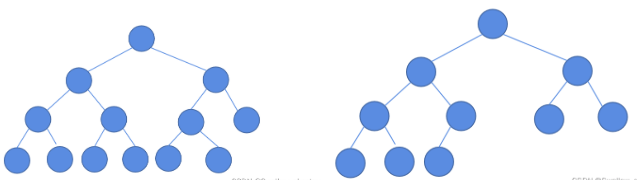
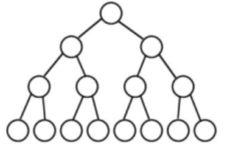
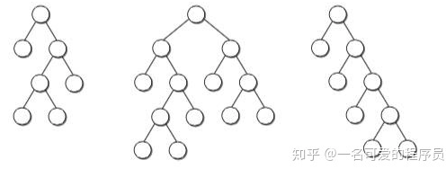

## 目录
  - [Complete Binary Tree(完全二叉树)](#complete-binary-tree完全二叉树)
  - [Perfect Binary Tree(完美二叉树)](#perfect-binary-tree完美二叉树)
  - [Full Binary Tree(满二叉树)](#full-binary-tree满二叉树)

### Complete Binary Tree(完全二叉树)
除了最后一层之外的其他每一层都被完全填充，并且所有结点都保持向左对齐。

### Perfect Binary Tree(完美二叉树)
除了叶子结点之外的每一个结点都有两个孩子，每一层(当然包含最后一层)都被完全填充。

### Full Binary Tree(满二叉树)
国内：如果每一个层的结点数都达到最大值，则这个二叉树就是满二叉树。就是完美二叉树。

国外：除了叶子结点之外的每一个结点都有两个孩子结点。

